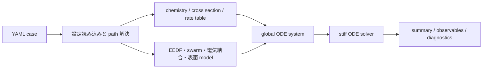

# Plasma Global Model

低圧プラズマの 0D global model を、YAML で定義した case から実行する研究用コードです。装置内を空間分解する 2D/3D 流体コードではなく、装置平均の粒子収支、電子エネルギー収支、壁損失、表面反応、RF/DC 電力結合をまとめて時間発展させます。

想定している使い方は、反応機構や電力結合モデルを組み替えながら、電子密度、平均電子エネルギー、吸収電力、イオン・ラジカル flux、反応収支を短時間で確認することです。実プロセスの最終予測に直接使うコードではなく、実験値、高次元モデル、外部 0D モデルと照合しながら育てるための基盤です。

## まず把握すること

| 観点 | 内容 |
|---|---|
| 何を解くか | 低圧プラズマの 0D 粒子バランスと電子エネルギー・電力結合の時間発展。 |
| 主な入力 | chamber、recipe、species、気相反応、表面反応、断面積または rate table、solver 設定。 |
| 主な出力 | `summary.yaml`、`observables.csv`、`solution.h5`、反応・電子エネルギー・表面収支の診断ファイル。 |
| 代表的な対象 | Ar 基準系、Ar LXCat 断面積ケース、ZDPlaskin example2 対応ケース、CRANE two-reaction Ar。 |
| 得意な用途 | 反応機構の検査、モデル closure の比較、ベンチマーク、コード拡張前の挙動確認。 |
| 対象外 | 空間分布を解く CFD/流体計算、sheath の高精度 1D/2D 解法、量産条件の最終保証。 |

## 計算の流れ



case YAML は `include` に対応しており、共通設定を `base_case.yaml` に置いたまま、装置、recipe、chemistry、出力先だけを case ごとに差し替えられます。実行後には、実際に使われた設定を `effective_case.yaml`、解決済みファイルパスを `resolved_paths.yaml` として出力します。

## できる計算

| 項目 | 実装内容 |
|---|---|
| 気相反応 | species、gas reaction、electron-impact reaction、rate table を読み込み、数密度の ODE を構成する。 |
| 電子エネルギー | 平均電子エネルギー、rate table、swarm backend による reduced-order closure を選択できる。 |
| 輸送・壁損失 | global model の粒子損失として、拡散損失、壁損失、表面反応を扱う。 |
| 電力結合 | direct power、ICP/RF envelope、DC series circuit などを backend として切り替える。 |
| 表面・wafer 量 | ion flux、radical flux、簡略 IED proxy、film thickness、etch/deposition balance を出力する。 |
| 診断 | reaction budget、electron energy budget、surface reaction budget、state manifest、provenance を出力できる。 |

## リポジトリ構成

```text
plasma_global/        solver、物理モデル、I/O、workflow の本体
examples/configs/     実行用 YAML case、chamber、recipe
examples/chemistry*/  species、反応、断面積、rate table
examples/outputs/     代表ケースの出力例
tools/external_benchmarks/
                      外部モデル比較とベンチマーク集計
docs/                 英語版ドキュメント
docs/ja/              日本語版ドキュメント
mkdocs.yml            英語・日本語を含む MkDocs 設定
mkdocs-ja.yml         日本語版だけを表示する MkDocs 設定
```

## インストール

Python 3.11 以上を想定しています。開発、HDF5 出力、プロット、ドキュメント表示をまとめて使う場合は次を実行します。

```bash
py -m pip install -e ".[io,plot,dev,docs]"
```

最小構成だけを入れる場合は次です。

```bash
py -m pip install -e .
```

README のコマンド例は、リポジトリ直下で確実に動く `py -m plasma_global.cli ...` 形式で書いています。editable install 後に console script が PATH に入っている環境では、`py -m plasma_global.cli` を `plasma-global` に置き換えられます。

## Quick Start

### 1. 最小 case を検証する

YAML、参照ファイル、chemistry manifest、backend 選択が解決できるかを確認します。

```bash
py -m plasma_global.cli validate examples/configs/case_smoke.yaml
```

正常なら `Validation OK` が表示されます。warning が出る場合は、設定として読めるが現 solver では使われない metadata、または model regime の注意を示します。

### 2. 最小 case を実行する

`case_smoke.yaml` は、設定読み込み、モデル構築、ODE 解法、出力生成までを短時間で確認するための case です。

```bash
py -m plasma_global.cli run examples/configs/case_smoke.yaml
```

代表的な実行結果は次の形になります。

```text
success: true
message: The solver successfully reached the end of the integration interval.
n_times: 200
t_end_s: 1.0e-06
final_electron_density_m3: 3.2007e+14
final_mean_electron_energy_eV: 2.408
final_port_source_rf_absorbed_power_W: 55.49
Outputs: examples/outputs/smoke_swarm
```

最初に見るファイルは次です。

| ファイル | 確認する内容 |
|---|---|
| `summary.yaml` | 計算成否、最終値、step ごとの代表値、warning 数。 |
| `observables.csv` | 時系列の電子密度、平均電子エネルギー、電力、flux、warning。 |
| `effective_case.yaml` | `include` と override を反映した実際の設定。 |
| `resolved_paths.yaml` | case から参照された入力ファイルの絶対パス。 |
| `solution.h5` | state vector の時系列。HDF5 出力を有効にした場合に生成される。 |

## 代表 case

| 目的 | 実行コマンド | 主な出力先 |
|---|---|---|
| 実行経路の確認 | `py -m plasma_global.cli run examples/configs/case_smoke.yaml` | `examples/outputs/smoke_swarm/` |
| Ar LXCat 基準計算 | `py -m plasma_global.cli run examples/configs/case_argon_lxcat.yaml` | `examples/outputs/argon_lxcat_icp_baseline/` |
| ZDPlaskin example2 対応 | `py -m plasma_global.cli run examples/configs/case_zdplaskin_example2.yaml` | `examples/outputs/zdplaskin_example2_surrogate/` |
| CRANE two-reaction Ar | `py -m plasma_global.cli run examples/configs/case_crane_two_reaction_argon.yaml` | `examples/outputs/crane_two_reaction_argon/` |
| RF envelope calibration | `py -m plasma_global.cli run examples/configs/case_rf_envelope_calibration.yaml` | `examples/outputs/argon_rf_envelope_calibration/` |

Ar LXCat case では、`summary.yaml` の `final_electron_density_m3`、`final_mean_electron_energy_eV`、`final_port_source_rf_absorbed_power_W`、`final_ion_flux_wafer_m2_s` を最初に確認します。立ち上がり、定常化、afterglow の挙動を見る場合は `observables.csv` を使います。

ZDPlaskin example2 対応 case では、通常の出力に加えて次の診断ファイルを確認します。

```text
reaction_budget.yaml
electron_energy_budget.yaml
surface_reaction_budget.yaml
state_manifest.yaml
run_provenance.yaml
comparison_zdplaskin_example2.yaml
```

この case は、外部コードの数値解法を再実装するものではありません。species、圧力、幾何、DC series circuit、E/N-rate table を対応させたうえで、本コード側の closure と solver の挙動を比較するためのものです。

## 設定と backend の確認

solver を走らせずに、解決済み設定だけを書き出せます。

```bash
py -m plasma_global.cli export-config examples/configs/case.yaml ./tmp_case_dump
```

出力は次の 2 ファイルです。

```text
tmp_case_dump/effective_case.yaml
tmp_case_dump/resolved_paths.yaml
```

利用可能な EEDF、電気結合、数値積分 backend と成熟度ラベルは次で確認します。

```bash
py -m plasma_global.cli list-backends
```

機械的に読む場合は JSON 出力を使えます。

```bash
py -m plasma_global.cli list-backends --json
```

## ドキュメント

日本語版だけを独立した MkDocs サイトとして見る場合は次です。

```bash
py -m mkdocs serve -f mkdocs-ja.yml -a 127.0.0.1:8002
```

ブラウザでは次を開きます。

```text
http://127.0.0.1:8002/
```

静的サイトとして確認する場合は次です。

```bash
py -m mkdocs build --strict -f mkdocs-ja.yml
```

通常の英語・日本語混在ドキュメントは次で表示します。

```bash
py -m mkdocs serve
```

日本語版の入口は [docs/ja/index.md](docs/ja/index.md) です。全体像、物理モデル、数値解法、入出力、ベンチマークは MkDocs のナビゲーションから順に確認できます。

## 検証済み範囲と未完了の範囲

| 範囲 | 現状 |
|---|---|
| YAML case 管理 | `schema_version 2`、`include`、`effective_case.yaml`、`resolved_paths.yaml` に対応。 |
| chemistry 入力 | species、gas reaction、surface reaction、cross-section / rate-table manifest を分離。 |
| 数値解法 | SciPy backend による stiff ODE 系の時間発展を中心に実装。 |
| Ar LXCat | 公開 Ar 断面積に基づく ICP baseline case を用意。 |
| ZDPlaskin | example2 条件に合わせた surrogate case と比較診断を用意。 |
| CRANE | two-reaction Ar benchmark を用意。 |
| PyGMol | Ar global-model 比較と差分分解用の出力を用意。 |
| 残る課題 | sheath / IED、輸送係数、壁損失、表面反応、電力結合は reduced-order model であり、条件ごとの照合が必要。 |

## テストとベンチマーク更新

通常のテストは次です。

```bash
py -m pytest
```

外部ベンチマーク集計を更新する場合は次を使います。

```bash
py tools/external_benchmarks/run_external_benchmarks.py
py tools/external_benchmarks/robustness_sweep.py
```

ベンチマークの入力データ一覧と外部モデル候補は次にあります。

```text
tools/external_benchmarks/benchmark_data_manifest.yaml
tools/external_benchmarks/external_model_registry_report.yaml
```

## 科学的な注意

このコードは reduced-order global model です。計算結果は、選択した closure、rate data、壁条件、電力結合モデルに依存します。実プロセスへ適用する場合は、対象条件ごとに実験値または高次元モデルとの照合を行ってください。高精度化する場合は、既存 backend を置き換える形で EEDF、swarm、sheath、surface、electrical model を拡張する設計です。
