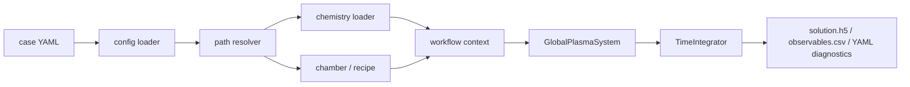
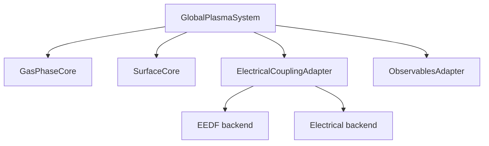

# アーキテクチャガイド

## 設計目標

このコードは、レビュー担当者が次の 3 点をすばやく追えるように分割されています。

| 問い | 見る場所 |
|---|---|
| ある入力値はどこから来るか | `plasma_global/config`, `workflows/context.py`, `effective_case.yaml` |
| 物理近似はどのモジュールが所有するか | `plasma_global/physics`, `plasma_global/electrical`, `plasma_global/eedf` |
| backend を置き換えるには何を変更するか | 各 registry と request/result interface |

## パッケージマップ

| パッケージ | 主な責務 | 代表的な入出力 |
|---|---|---|
| `plasma_global/config` | case schema、YAML include/override、パス解決、effective config 出力 | case YAML -> 解決済み設定 |
| `plasma_global/chemistry` | 化学種、反応、反応式パース、断面積、mechanism validation | CSV/YAML -> reaction set |
| `plasma_global/reactor` | chamber topology、recipe 定義 | chamber/recipe YAML |
| `plasma_global/eedf` | EEDF/swarm closure | `EEDFRequest -> EEDFResult` |
| `plasma_global/electrical` | 吸収パワー、reduced electrical model | `PowerRequest -> PowerResult` |
| `plasma_global/numerics` | state layout、system assembly、Jacobian、time integration | RHS/Jacobian |
| `plasma_global/observables` | 工学・物理量の後処理 | state -> observables |
| `plasma_global/workflows` | 実行可能 case の組み立て | config -> runnable system |

## 実行フロー

## 主要な設計判断

### 1. case assembly と execution の分離

`workflows/context.py` は、設定ロード、パス解決、検証、chamber/recipe/mechanism 読み込み、EEDF/electrical/integrator 構築、system 構築を担当します。

`workflows/runner.py` は、recipe segment の実行、出力ファイルの書き込み、再現性ファイルの export を担当します。

この分離により、入力解決と数値実行を別々に検査できます。

### 2. 差し替え可能な backend interface

主な拡張点は次の 4 つです。

| Interface | 差し替える対象 |
|---|---|
| `EEDFBackend` | EEDF/rate table 評価 |
| `SwarmModel` | swarm closure |
| `ElectricalBackend` | 電力・回路・RF 入力 |
| `TimeIntegrator` | stiff ODE 積分器 |

### 3. 明示的な file manifest

case は chamber YAML、recipe YAML、chemistry manifest YAML、任意の external inputs を指します。chemistry manifest は species CSV、gas reaction CSV、surface reaction CSV、model YAML、cross-section manifest YAML を指します。

暗黙のファイル名に頼らないため、レビュー時に「この run が何を読んだか」を追いやすくなります。

### 4. 内部 physics collaborator の分割

transient system は内部的に次の collaborator に分かれています。

`GlobalPlasmaSystem` は ODE solver から見える代表オブジェクトですが、現在は全ロジックを直接抱えるのではなく、各 collaborator を調停する役割に寄っています。

## 現在の大きな結合点

`GlobalPlasmaSystem` は今も multiphysics coupling の中心です。これは妥当ですが、次の規律を守る必要があります。

- 物理量の assembly は行ってよい。
- configuration や file I/O の唯一の置き場にしてはいけない。
- 新しい詳細 closure は、対応する collaborator または backend に置く。

そのため loader、manifest resolution、registry、documentation は外側に分離されています。
