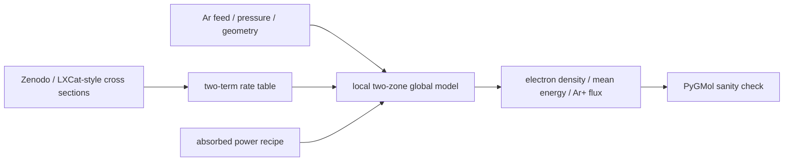

# Ar LXCat 基準ケース

このページは、pure-Ar ICP の基準 case `examples/configs/case_argon_lxcat.yaml` を説明します。公開 cross-section data を使う production baseline であり、PyGMol との比較は strict validation ではなく sanity check として扱います。

## 結論

この case は、Ar feed、pressure、absorbed power、LXCat-style cross sections を使った local global model が、物理的に自然な時間応答を示すかを確認する入口です。主に electron density、mean electron energy、absorbed power、Ar+ flux、pressure を見ます。

PyGMol との比較では、powered phase の桁と trend、power off 後の electron cooling、ion flux と electron density の連動を確認します。local model は two-zone、PyGMol は one-zone なので、完全一致は期待しません。

## 入力と出力



| 項目 | 内容 |
|---|---|
| case | `examples/configs/case_argon_lxcat.yaml` |
| chamber | `examples/configs/chamber_argon_icp.yaml` |
| chemistry | `examples/chemistry_argon_lxcat` |
| cross section | Zenodo/LXCat-style Ar data |
| gas temperature | fixed |
| main outputs | electron density、mean electron energy、absorbed power、Ar+ flux、pressure |

gas temperature を固定しているため、この baseline では gas heating ではなく electron collision、transport、power response を見ます。excited Ar density は evolution せず、excitation channels は主に electron energy loss として扱います。

## データソース

Ar chemistry bundle は、Anthony Schmalzried による BOLSIG+ format cross-section data を元にしています。local bundle には Ar momentum transfer、ground-state ionization、複数の excitation curves が含まれます。

この data source は local Ar case の electron-impact kinetics を与えますが、PyGMol の compact model に含まれる Arrhenius-style rate fit と同一ではありません。そのため、PyGMol 比較では raw mismatch をそのまま精度不足とは読みません。

## PyGMol との比較


overview 図の PyGMol panel は、raw comparison と same-footing comparison を並べています。raw comparison には、rate fit、geometry、power deposition、wall loss の差がすべて含まれます。


decomposition 図では、local/PyGMol ratio が 1 に近づくほど対象 scalar が近いことを示します。electron-impact rates、absorbed power、wall-loss coefficient を順に揃えたときに差が縮むなら、主な不一致は solver 実装ではなく model closure の差として説明できます。

## 実行

```powershell
py -m plasma_global.cli validate examples\configs\case_argon_lxcat.yaml
py -m plasma_global.cli run examples\configs\case_argon_lxcat.yaml
```

PyGMol comparison:

```powershell
py -m pip install ".[compare]"
py tools\external_benchmarks\pygmol_argon.py --rerun-local
```

出力先:

```text
examples/outputs/argon_lxcat_icp_baseline
```

## レビュー時の注意

この baseline は production case の初期確認です。metastable、resonant states、stepwise ionization、gas heating、surface chemistry を含む detailed Ar model の検証ではありません。PyGMol と比較するときは、density の絶対一致よりも、powered phase の桁、afterglow cooling、flux trend、pressure handling を優先して見ます。

## 参考リンク

| 対象 | 参考 |
|---|---|
| PyGMol | [PyPI: pygmol](https://pypi.org/project/pygmol/) |
| Ar cross-section data | [Zenodo DOI 10.5281/zenodo.8192503](https://doi.org/10.5281/zenodo.8192503) |
| BOLSIG+ / LXCat | [LXCat BOLSIG+ solver page](https://nl.lxcat.net/solvers/BolsigPlus/index.php?step=1) |
