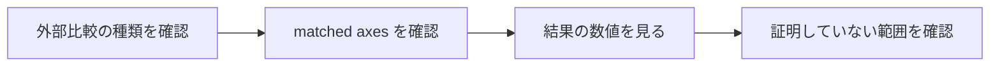

# ベンチマーク判定基準

このページでは、外部比較の合否をどう読むかをまとめます。対象読者は、結果をレビューするシミュレーションエンジニアと物理モデルの妥当性を確認する研究者です。

## 結論

ベンチマーク結果は 1 つの尺度では読めません。ZDPlaskin と CRANE は比較軸を強く揃えた validation です。一方、PyGMol は model-form difference を含む executable sanity check、robustness sweep は accuracy ではなく numerical health の確認です。

したがって、結果を見る順序は次の通りです。

## 判定の早見表

| 比較 | 合格と読む条件 | 証明しないこと |
|---|---|---|
| ZDPlaskin example2 | final species、E/N、電流、電力が同じ practical footing で数 % 程度に収まる | 他圧力、RF、混合ガス、surface model の一般精度 |
| CRANE TwoReactionArgon | SI 変換後の `Ar`, `Ar+`, `e` final density が小さい相対誤差で一致する | Boltzmann kinetics、wall loss、電気回路、gas heating |
| PyGMol Ar | powered phase の桁と傾向が自然で、rate/power/wall loss を揃えると差が説明しやすくなる | one-zone PyGMol と two-zone local model の完全一致 |
| robustness sweep | density と energy が有限・正で、E/N が rate table 範囲内にある | stress 条件での外部 solver との精度一致 |

この表の「証明しないこと」は、失敗ではなく比較設計の範囲です。論文や技術報告で結果を使う場合は、この列を明示してください。

## 相対誤差の定義

overview 図の偏差は、基本的に次の形で読みます。

$$
\mathrm{relative\ deviation}[\%]
= 100
\left|
\frac{q_{\mathrm{local}}}{q_{\mathrm{reference}}} - 1
\right|
$$

ただし、PyGMol のように比較対象のモデル構造が違う場合、この値は strict pass/fail ではありません。差分要因を分解するための入口として使います。

## 統合図の読み方

ZDPlaskin panel は final operating state の一致を見る図です。電流、電力、E/N、species density が同時に近いことが重要で、単一の density だけで判断しません。

CRANE panel は反応ネットワークの切り出し検証です。ここでの小さい誤差は、stoichiometry、単位変換、stiff ODE integration が整合していることを示します。

PyGMol panel は strict validation ではなく、global model closure の違いがどれほど効くかを見る図です。raw mismatch が大きくても、それが rate、power、wall loss の差で説明できるなら、次に見るべき対象は solver bug ではなく物理仮定です。

## レビュー時の確認項目

レビューでは、次の 4 点を確認します。

1. 比較対象と local case が何を揃えているか。
2. final state と transient を混同していないか。
3. accuracy claim と robustness claim を分けているか。
4. その benchmark が見ていない物理軸を、結果の根拠にしていないか。

この観点で読むと、各 benchmark の役割は次のように整理できます。ZDPlaskin は Ar DC discharge の final parity、CRANE は scalar chemistry ODE、PyGMol は Ar global model の差分診断、robustness sweep は条件変更時の solver health です。

## 詳細ページ

- [外部ベンチマーク](EXTERNAL_BENCHMARKS.md)
- [ZDPlaskin 比較](ZDPLASKIN_COMPARISON.md)
- [CRANE 比較](CRANE_COMPARISON.md)
- [Argon executable comparison](ARGON_EXECUTABLE_COMPARISON.md)
- [Robustness Benchmark](ROBUSTNESS_BENCHMARKS.md)
