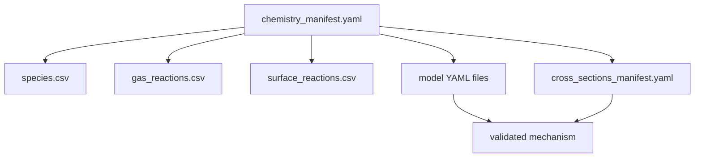
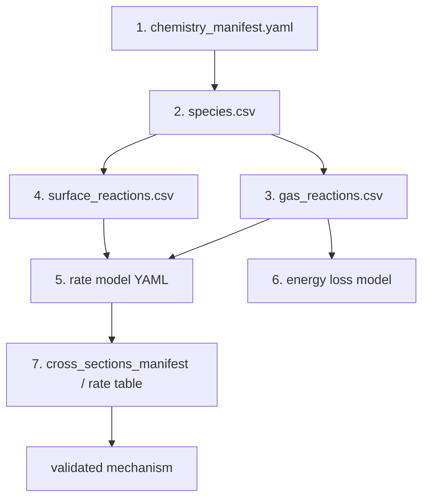

# 化学入力仕様

## 基本方針

化学は main case configuration から意図的に分離されています。process engineer や chemistry developer が reaction set を編集しても、solver 設定に触らなくてよいようにするためです。



## ファイル構成

| ファイル | 内容 |
|---|---|
| `chemistry_manifest.yaml` | chemistry bundle の top-level index |
| `species.csv` | species 定義 |
| `gas_reactions.csv` | gas-phase reaction |
| `surface_reactions.csv` | surface reaction |
| `reaction_models.yaml` | legacy の rate-law / energy-loss model 集約ファイル |
| `electron_impact_models.yaml` | cross-section 由来の electron-impact model |
| `gas_rate_models.yaml` | empirical / formula rate model |
| `energy_loss_models.yaml` | event energy loss model |
| `cross_sections_manifest.yaml` | swarm/EEDF backend が読む cross-section dataset |

## chemistry bundle の読み順

chemistry bundle は、ファイル名順ではなく次の順番で読むと、species、reaction、rate、cross-section の関係を追いやすくなります。



| 順番 | 見るもの | 判断すること |
|---:|---|---|
| 1 | `chemistry_manifest.yaml` | どの CSV / YAML を bundle として読むか |
| 2 | `species.csv` | どの species が gas state / surface state / metadata か |
| 3 | `gas_reactions.csv` | gas-phase で何が生成・消費されるか |
| 4 | `surface_reactions.csv` | wall / wafer で何が吸着・脱離・反応するか |
| 5 | `reaction_models.yaml` または split model files | 各 reaction の rate law が何か |
| 6 | `energy_loss_models.yaml` | electron-impact reaction が electron energy をどれだけ失うか |
| 7 | `cross_sections_manifest.yaml` / table | electron-impact rate の元データ |

## 1 reaction を追う手順

例として smoke chemistry の gas reaction を 1 本追います。

```csv
G0001,gas,"e + CF4 -> CF3 + F + e",RM_E_CF4_DISS,EM_E_CF4_DISS,source|process,,true,example electron-impact dissociation
```

| 列 | 読み方 |
|---|---|
| `reaction_id` | `G0001`。budget や error message で参照する一意 ID |
| `phase` | `gas`。gas-phase ODE source として扱う |
| `equation` | `CF4` が減り、`CF3` と `F` が増える |
| `rate_model_key` | `RM_E_CF4_DISS`。rate law の YAML key |
| `energy_model_key` | `EM_E_CF4_DISS`。electron energy loss の YAML key |
| `zone_filter` | `source|process`。両 zone で有効 |
| `surface_filter` | 空欄。surface 反応ではない |
| `enabled` | `true`。mechanism に含める |

対応する model YAML は次のように読みます。

```yaml
rate_models:
  RM_E_CF4_DISS:
    backend: electron_impact_xsec
    cross_section_id: xs_cf4_dissociation
    branching_yield: 1.0

  EM_E_CF4_DISS:
    backend: constant_event_loss
    energy_loss_eV: 12.5
```

この反応は、`cross_section_id: xs_cf4_dissociation` から electron-impact rate を評価し、1 event あたり `12.5 eV` を electron energy から失う、という意味です。

## `species.csv` の読み方

`species.csv` は「reaction equation に出てくる名前を、solver がどう扱うか」を決めます。

smoke chemistry の例:

```csv
canonical_id,display_name,phase,charge,mass_amu,elements,aliases,state_tags,zones,surfaces
CF4,CF4,gas,0,88.0043,C:1;F:4,,stable|parent,source|process,
CF3,CF3,gas,0,69.0037,C:1;F:3,,radical,source|process,
F,F,gas,0,18.9984,F:1,,radical,source|process,
wafer:*,wafer:*,surface,0,0.0,site:1,wafer_site|wafer_*,site,,wafer
wafer:F*,wafer:F*,surface,0,18.9984,F:1;site:1,,adsorbate,,wafer
```

| 列 | 読むポイント |
|---|---|
| `canonical_id` | reaction equation で使う標準名。`Ar_plus` や `wafer:F*` のように solver 内の ID を明示する |
| `phase` | `gas` は gas density state、`surface` は coverage / site / film 系の state または metadata |
| `charge` | quasi-neutral electron density や charge conservation に効く |
| `mass_amu` | flux、Bohm speed、transport estimate に効く |
| `elements` | element conservation validation に使う。surface site は `site:1` のように表す |
| `state_tags` | `radical`, `ion`, `site`, `adsorbate` など、diagnostics や読み手向けの分類 |
| `zones` | gas species をどの zone で扱うか |
| `surfaces` | surface species をどの surface で扱うか |

よくある見落とし:

| 症状 | 見る場所 |
|---|---|
| reaction equation の species が見つからない | `canonical_id` と `aliases` |
| charge conservation error | `charge` と equation の電子数 |
| element conservation error | `elements` と stoichiometry |
| surface reaction が効かない | surface species の `surfaces` と reaction の `surface_filter` |

## `species.csv`

主な列:

| 列 | 意味 |
|---|---|
| `canonical_id` | solver 内の標準 species ID |
| `phase` | gas / surface など |
| `charge` | 電荷数 |
| `mass_amu` | 質量 |
| `elements` | 元素組成 |
| `aliases` | 入力で許す別名 |
| `state_tags` | excited/metastable などの tag |
| `zones` | 適用 zone |
| `surfaces` | 適用 surface |

## model files の分割

新しい chemistry bundle では、legacy の `reaction_models.yaml` だけに詰めるより、次の分割を推奨します。

```yaml
model_files:
  electron_impact: electron_impact_models.yaml
  gas_rate: gas_rate_models.yaml
  energy_loss: energy_loss_models.yaml
```

| Category | 想定内容 | 許可 backend |
|---|---|---|
| `electron_impact` | tabulated electron-collision cross section から評価する rate | `electron_impact_xsec` |
| `gas_rate` | cross-section を使わない formula rate | `constant`, `first_order_loss`, `arrhenius`, `te_power_law` |
| `energy_loss` | event あたりの電子エネルギー損失 | `constant_event_loss` |

cross-section curve は `cross_sections_manifest.yaml` に置き、reaction と cross-section ID の対応は `electron_impact_models.yaml` に置きます。Arrhenius や electron-temperature power law のような rate expression は `gas_rate_models.yaml` に置きます。

## rate model backend の使い分け

`rate_model_key` が指す backend は、reaction の物理的な意味に合わせて選びます。

| Backend | 代表用途 | 典型的な入力 | 注意 |
|---|---|---|---|
| `electron_impact_xsec` | 電子衝突 ionization / excitation / dissociation / attachment | `cross_section_id`, `branching_yield` | cross-section または rate table の品質が支配的 |
| `constant` | 温度や場に依存しない rate | `value` | 単位は reaction order に依存 |
| `arrhenius` | neutral-neutral、ion-molecule 反応 | `A`, `beta`, `Ea_eV` | gas temperature 依存として読む |
| `te_power_law` | electron-temperature 依存の経験式 | `A`, `Tref_K`, `alpha` | cross-section がある反応の代替にしない |
| `first_order_loss` | metastable diffusion loss / wall quench surrogate | `rate_s_inv` | resolved wall model ではない |
| `sticking` | neutral/radical adsorption | `sticking_value`, `coverage_factor` | surface site availability に注意 |
| `ion_assisted` | ion による desorption / etch proxy | `yield_value`, `threshold_eV` | IED proxy の限界を理解して使う |
| `desorption` | thermal desorption | `nu0_s_inv`, `Ea_eV` | surface temperature に敏感 |
| `langmuir_hinshelwood` | adsorbate 同士の surface recombination | `A_m2_s_inv`, `Ea_eV` | coverage の 2 乗で効くことが多い |

## gas reaction CSV の読み方

gas reaction は、zone 内の species balance に直接入ります。

| 反応タイプ | 例 | 読み方 |
|---|---|---|
| electron-impact ionization | `e + Ar -> Ar_plus + e + e` | `Ar` を消費し、ion と電子を増やす。electron energy loss も見る |
| electron-impact dissociation | `e + CF4 -> CF3 + F + e` | radical source。surface flux の入口になる |
| attachment | `e + O2 -> O_minus + O` | electron を減らし negative ion を増やす |
| neutral recombination | `F + CF3 -> CF4` | radical sink |
| ion-molecule conversion | `Ar2_plus + Ar -> Ar_plus + Ar + Ar` | ion composition を変える |
| three-body reaction | `Ar_plus + e + e -> Ar + e` | pressure / density に強く依存 |

gas reaction を読むときの checklist:

| 確認 | 理由 |
|---|---|
| reactant / product の species が `species.csv` にあるか | mechanism loading の基本 |
| electron が両辺でどう増減するか | charge balance と quasi-neutral closure に効く |
| `energy_model_key` が必要な electron-impact 反応に付いているか | electron energy balance に効く |
| `zone_filter` が意図した zone を含むか | multi-zone case で反応が効く場所が変わる |
| `enabled` が `true` か | 無効化された反応は budget に出ない |

## surface reaction CSV の読み方

surface reaction は、gas species と surface species を同時に扱います。
表面・ウェハ diagnostics と IED proxy の読み方は [表面・ウェハ・IED ガイド](SURFACE_WAFER_IED_GUIDE.md) も参照してください。

```csv
S1001,surface,"F + wafer:* -> wafer:F*",RM_S_F_WAFER_STICK,,process,wafer,true,adsorption on wafer
S1005,surface,"Ar_plus + wafer:F* -> Ar_plus + wafer:* + F",RM_S_AR_ION_DESORB,,process,wafer,true,ion-assisted desorption of adsorbed fluorine
S1007,surface,"wafer:F* + wafer:F* -> wafer:* + wafer:* + F2",RM_S_F_LH_RECOMB,,process,wafer,true,Langmuir-Hinshelwood recombination example
```

| 反応 | 意味 | 主に見る model |
|---|---|---|
| `F + wafer:* -> wafer:F*` | F radical が空き site に吸着 | `sticking`, `site_blocking` |
| `CF3 + wafer:* -> wafer:poly* + F` | polymer precursor が付着し、F を戻す | `sticking` |
| `Ar_plus + wafer:F* -> Ar_plus + wafer:* + F` | ion assist で adsorbate を剥がす | `ion_assisted` |
| `wafer:F* -> wafer:* + F` | thermal desorption | `desorption` |
| `wafer:F* + wafer:F* -> wafer:* + wafer:* + F2` | Langmuir-Hinshelwood recombination | `langmuir_hinshelwood` |

surface reaction を読むときの checklist:

| 確認 | 理由 |
|---|---|
| `surface_filter` が chamber の `surface_id` と一致するか | 反応がどの surface で効くかを決める |
| surface species の `surfaces` が一致するか | `wafer:F*` が `wafer` にだけ属するなど |
| 空き site `wafer:*` が reaction に入っているか | site blocking / coverage conservation に効く |
| ion-assisted reaction が ion flux / ion energy と結びつくか | wafer IED proxy の解釈に効く |
| surface output で `site_fill_*`, `free_site_fraction_*`, `net_flux_*` を見るか | 反応が実際に効いているか確認する |

## ZDPlaskin parity chemistry の読み方

ZDPlaskin example2 用 bundle は、split model files を使う例です。

```yaml
model_files:
  electron_impact: electron_impact_models.yaml
  gas_rate: gas_rate_models.yaml
  energy_loss: energy_loss_models.yaml
```

`gas_reactions.csv` では、electron-impact reaction と heavy-particle reaction が同じ CSV に並びます。

| Reaction | rate model | 意味 |
|---|---|---|
| `ZDP_AR_ION` | `RM_E_AR_ION_ZDP` | ground-state Ar ionization |
| `ZDP_AR_EXC` | `RM_E_AR_EXC_ZDP` | `Ar` から `Ar_star` への excitation |
| `ZDP_ARSTAR_DEEXC` | `RM_E_ARSTAR_DEEXC_ZDP` | output-derived E/N table による de-excitation |
| `ZDP_AR2PLUS_DISS_RECOMB` | `RM_AR2PLUS_DISS_RECOMB_ZDP` | electron recombination |
| `ZDP_ARPLUS_CLUSTERING` | `RM_ARPLUS_CLUSTERING_ZDP` | `Ar_plus` から `Ar2_plus` への clustering |

この bundle は「一般的な Ar chemistry の推奨セット」ではなく、ZDPlaskin example2 と同じ footing に揃えるための parity chemistry として読みます。

## 明示的な一次損失

`first_order_loss` は、metastable diffusion loss や wall quench surrogate など、species-specific volumetric loss を表す通常の gas reaction です。機械学習 surrogate でも、resolved sheath model でもありません。

反応は、非電子 gas reactant を 1 つ、stoichiometry 1 で持つ必要があります。

```csv
reaction_id,phase,equation,rate_model_key,energy_model_key,zone_filter,surface_filter,enabled,notes
ARSTAR_DIFFUSION_LOSS,gas,Ar_star -> Ar,RM_ARSTAR_DIFFUSION_LOSS,,plasma,,true,metastable first-order wall/diffusion loss
```

```yaml
rate_models:
  RM_ARSTAR_DIFFUSION_LOSS:
    backend: first_order_loss
    rate_s_inv: 2.0e5
```

一次損失の形は次です。

$$
S_j = -k_j n_j
$$

helper script:

```bash
py scripts/generate_species_losses.py losses.yaml --output-dir generated_loss_chemistry
```

## `te_power_law`

例:

```yaml
rate_models:
  RM_EXAMPLE:
    backend: te_power_law
    A: 8.5e-13
    Tref_K: 300.0
    alpha: -0.67
    electron_temperature_factor: 0.6666666666666666
```

平均電子エネルギーから電子温度を推定します。

$$
T_e[\mathrm{K}]
  = f_T\,\langle\varepsilon\rangle[\mathrm{eV}]\,11604.5
$$

default の $f_T = 2/3$ は Maxwellian での平均エネルギーと温度の関係に対応します。cross-section data がある反応には `te_power_law` を使わず、`electron_impact` に置いてください。

## 外部 rate-table workflow

BOLSIG+ など外部 swarm solver の raw/exported table は solver 外に置き、標準 HDF5 `rate_table` 形式へ変換します。

```text
rate_table_dir/
  rates.csv
  transport.csv
  metadata.yaml
```

`rates.csv` は `mean_energy_eV` または `EoverN_Td` などの grid column と、cross-section ID 名の rate coefficient column を持ちます。`transport.csv` は同じ grid column と、`mean_energy_eV`, `effective_field_Td`, `mobility_m2_V_s`, `diffusion_m2_s` などを持てます。

```bash
py scripts/build_rate_table_h5.py rate_table_dir --output rate_table.h5
```

E/N grid の table を local-field lookup で使う例:

```yaml
physics:
  eedf_backend: rate_table

swarm:
  model_name: table
  closure: local_field
  table:
    file: tables/my_eovern_rates.h5
    lookup: local_field
    electron_energy_mode: table_relaxation
    energy_relaxation_time_s: 1.0e-6
```

`table_relaxation` は、reaction rate を electrical backend の E/N で制御しつつ、evolved electron energy diagnostic を table の mean energy と整合させます。

## CSV と YAML を併用する理由

| 形式 | 得意な内容 |
|---|---|
| CSV | 大きな reaction table、species list |
| YAML | ネストした model detail、metadata、backend 固有設定 |

## validation

mechanism validation は次を確認します。

- species の存在
- reaction equation の parseability
- charge conservation
- element conservation
- duplicate reaction
- surface-site 関連
- cross-section sanity

これは単なる便利機能ではなく、研究用 chemistry dataset を長期的に壊れにくくするための防護線です。
