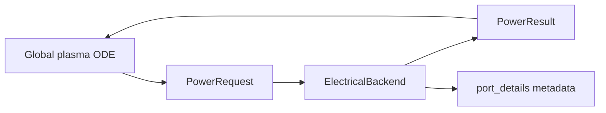
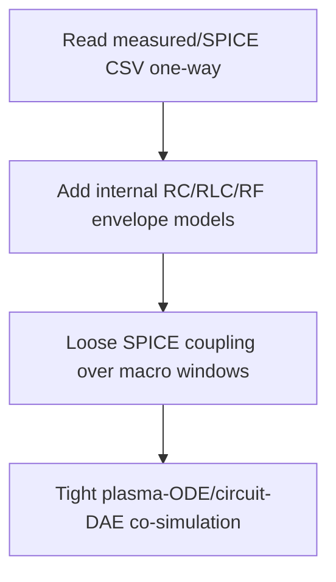

# 回路結合

## 設計目標

電気回路は plasma chemistry、transport、surface model から意図的に分離されています。plasma solver は `PowerRequest` と `PowerResult` を通じて electrical model と会話し、回路固有の式は electrical backend layer の下に閉じ込めます。



この設計により、次のことが局所化されます。

- internal DC、pulsed、RC、RF-envelope model の変更は `plasma_global.electrical` 内で完結する。
- plasma chemistry は、power が fixed command、internal circuit、external SPICE waveform のどこから来たかを知らなくてよい。
- 将来の external-circuit coupling は、同じ port metadata と `PowerResult` fields を再利用できる。

## 現在の circuit backend

| Backend | 使う場面 | 結合の向き |
|---|---|---|
| `dc_series_circuit` | DC / pulsed-DC の voltage source、ballast resistor、conductive plasma load | plasma density から load を計算 |
| `external_circuit_table` | 測定値、ngspice、外部 tool の waveform/result CSV | 外部 -> plasma の一方向 |
| `rf_envelope` | HF/LF の RF 周期平均 power、RMS voltage、bias proxy | recipe-scale envelope |

## `dc_series_circuit`

設定例:

```yaml
physics:
  electrical_backend: dc_series_circuit

power_ports:
  dc_drive:
    mode: voltage_source
    zone_id: plasma
    voltage:
      waveform: pulsed_square
      high_V: 1000.0
      low_V: 0.0
      duty_cycle: 0.5
      frequency_Hz: 1.0e4
    ballast_resistance_ohm: 1.0e5
    gap_m: 0.004
    electrode_area_m2: 5.0e-5
```

必須または重要な parameter:

| Key | 意味 |
|---|---|
| `source_voltage_V` | ballast resistor 前の open-circuit source voltage |
| `voltage.*` | pulsed waveform を含む nested voltage block |
| `ballast_resistance_ohm` | source と plasma の間の直列抵抗 |
| `gap_m` | electrode または effective plasma-load gap |
| `electrode_area_m2` | effective current-carrying area |

任意 parameter:

| Key | Default | 意味 |
|---|---:|---|
| `electron_mobility_m2_V_s` | pressure-scaled estimate | load model 用の定数 electron mobility |
| `mobility_ref_m2_V_s` | `0.10` | mobility scaling の reference |
| `mobility_ref_pressure_Pa` | `133.322` | inverse-pressure scaling の reference pressure |
| `power_absorption_fraction` | `1.0` | conductive plasma power のうち electron energy に入る割合 |
| `min_plasma_resistance_ohm` | `1.0e-6` | plasma resistance の下限 |
| `max_plasma_resistance_ohm` | `1.0e12` | plasma resistance の上限 |

計算式:

$$
G_{\mathrm{plasma}}
  = \frac{e n_e \mu_e A}{d}
$$

$$
R_{\mathrm{plasma}} = \frac{1}{G_{\mathrm{plasma}}},\qquad
I = \frac{V_{\mathrm{source}}}{R_b + R_{\mathrm{plasma}}}
$$

$$
V_{\mathrm{gap}} = I R_{\mathrm{plasma}},\qquad
P_{\mathrm{abs}} = f_{\mathrm{abs}} V_{\mathrm{gap}} I
$$

$$
E/N = \frac{|V_{\mathrm{gap}}|/d}{N}
$$

この model は sheath capacitance、RLC ringing、matching network、SPICE DAE を解きません。透明な reduced circuit model として扱います。

## `external_circuit_table`

外部回路解が測定、ngspice、別 tool から与えられる場合に使います。

```yaml
files:
  external_inputs:
    circuit_result_csv: ../external/circuit/ngspice_result.csv

physics:
  electrical_backend: external_circuit_table

power_ports:
  circuit_waveform:
    zone_id: plasma
    file_key: circuit_result_csv
    power_column: absorbed_power_W
    voltage_column: voltage_V
    current_column: current_A
    reduced_field_column: reduced_field_Td
    interpolation: linear
    hold: edge
```

CSV は `time_s` と、次のどちらかを含む必要があります。

| 入力 | deposited power |
|---|---|
| `absorbed_power_W`, `power_W`, `plasma_power_W` など | その列を使用 |
| `voltage_V` と `current_A` | $P = V I$ を使用 |

任意の `reduced_field_Td` は local-field EEDF study に使えます。この backend は evolving plasma impedance を外部回路へ返しません。

## `rf_envelope`

HF/LF を RF-period-averaged absorbed power と optional bias proxy として扱います。

```yaml
physics:
  electrical_backend: rf_envelope

power_ports:
  hf_source:
    role: hf_source
    zone_id: source
    frequency_Hz: 13.56e6
    value_W: 300.0
    coupling_efficiency: 0.65
    base_reduced_field_Td: 25.0
    reduced_field_per_sqrt_W_Td: 1.0
  lf_bias:
    role: lf_bias
    zone_id: process
    frequency_Hz: 400.0e3
    voltage_rms_V: 100.0
    effective_impedance_ohm: 50.0
    coupling_efficiency: 0.25
    self_bias_fraction: 0.35
```

必須 parameter:

| Key | 意味 |
|---|---|
| `frequency_Hz` | cycle-averaged envelope が代表する carrier frequency |
| `value_W` / `power_W` / `absorbed_power_W` | power-driven command |
| `voltage_rms_V` / `voltage_V` / `value_V` | voltage-driven command |
| `effective_impedance_ohm` | voltage だけが与えられる場合に必要 |

この model は RF period、sheath motion、matching network、harmonics を解きません。係数範囲と較正手順は [RF_ENVELOPE_CALIBRATION.md](RF_ENVELOPE_CALIBRATION.md) を参照してください。

## 出力 diagnostics

backend は `PowerResult.metadata["port_details"]` に回路詳細を書きます。数値 metadata は `observables.csv` に次の形式で展開されます。

```text
port_<port_id>_<metric>
```

例:

- `port_dc_drive_gap_voltage_V`
- `port_dc_drive_current_A`
- `port_lf_bias_self_bias_V`

`summary.yaml` には主要 port quantity の final / per-step statistics だけが入り、backend 固有の詳細時系列は `observables.csv` に残ります。

## 将来の external-circuit entry

予約済みの設定 path は `files.external_inputs` です。

```yaml
files:
  external_inputs:
    circuit_netlist: ../external/circuit/example.cir
    circuit_waveform_csv: ../external/circuit/waveform.csv
    circuit_result_csv: ../external/circuit/ngspice_result.csv
```

推奨 stages:



現時点では一方向 table interface と予約 path までを意図的な到達点としています。ngspice 実行や coupled circuit/plasma DAE はまだ実装対象ではありません。
