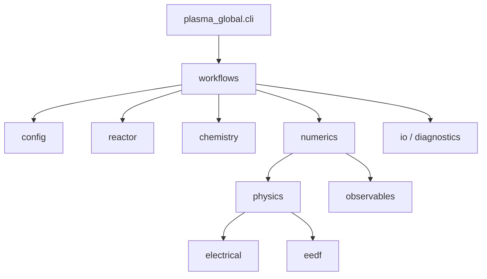
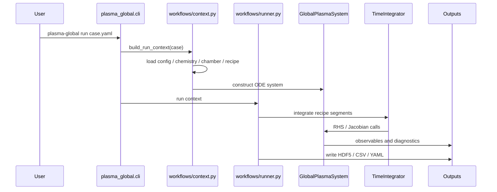

# コードモジュール一覧

## 入口の見取り図

## package 単位の責務

| Package | 何を担当するか | 最初に見る file |
|---|---|---|
| `plasma_global.cli` | command line entry point | `plasma_global/cli.py` |
| `plasma_global.api` | Python API の公開入口 | `plasma_global/api.py` |
| `plasma_global.config` | case YAML、include、path resolution、schema validation | `config/loader.py`, `config/models.py`, `config/validator.py` |
| `plasma_global.chemistry` | species、reaction、cross section、mechanism validation | `chemistry/io.py`, `chemistry/models.py`, `chemistry/parser.py` |
| `plasma_global.reactor` | chamber、zone、surface、recipe | `reactor/io.py`, `reactor/models.py` |
| `plasma_global.eedf` | EEDF/rate backend | `eedf/base.py`, `eedf/table.py`, `eedf/boltzmann_2term.py` |
| `plasma_global.electrical` | power coupling、circuit、RF envelope | `electrical/base.py`, `electrical/coupling_adapter.py` |
| `plasma_global.physics` | gas/surface source term、state interaction | `physics/gas_phase_core.py`, `physics/surface_core.py` |
| `plasma_global.numerics` | state layout、RHS/Jacobian、integrator | `numerics/system.py`, `numerics/scipy_backend.py` |
| `plasma_global.observables` | derived diagnostics、warning、KPI | `observables/adapter.py` |
| `plasma_global.io` | HDF5 output | `io/hdf5_writer.py` |
| `plasma_global.diagnostics` | provenance などの diagnostic export | `diagnostics/provenance.py` |
| `plasma_global.workflows` | case から runnable system を組み立て、実行する | `workflows/context.py`, `workflows/runner.py` |
| `plasma_global.core` | registry と backend metadata | `core/registry.py` |
| `plasma_global.plotters` | plot defaults | `plotters/defaults.py` |

## 実行時の call flow

## 物理計算の内部分割

| Collaborator | 担当 |
|---|---|
| `GasPhaseCore` | gas reaction、flow、pump、inter-zone transport、electron/ion density reconstruction |
| `SurfaceCore` | surface reaction、coverage、wall inventory、film state、surface gas flux |
| `ElectricalCouplingAdapter` | `PowerRequest` と `EEDFRequest` を作り backend を呼ぶ |
| `ObservablesAdapter` | time-series observable、KPI、warning flag |

`GlobalPlasmaSystem` はこれらを束ねる orchestrator です。新しい詳細物理を足すときは、可能な限りこの 4 分割か backend 側に置きます。

## どこを読めばよいか

| 目的 | 読む場所 |
|---|---|
| YAML がどう解決されるか | `plasma_global/config/loader.py` |
| chemistry CSV/YAML がどう解釈されるか | `plasma_global/chemistry/io.py`, `parser.py`, `validators.py` |
| ODE state vector の並びを知りたい | `plasma_global/numerics/state_layout.py`, `state_manifest.yaml` |
| RHS の source term を追いたい | `physics/gas_phase_core.py`, `physics/surface_core.py` |
| electrical backend を追加したい | `electrical/base.py`, `electrical/direct_power.py` など |
| EEDF/rate backend を追加したい | `eedf/base.py`, `eedf/table.py` |
| output column の由来を知りたい | `observables/adapter.py`, [モデルの入力と出力](MODEL_INPUT_OUTPUT.md) |
| benchmark tool を見たい | `tools/external_benchmarks/` |

## core package 外の重要ディレクトリ

| Path | 役割 |
|---|---|
| `examples/configs/` | 実行 case、chamber、recipe |
| `examples/chemistry*/` | chemistry bundle |
| `examples/outputs/` | example output と benchmark output |
| `tools/external_benchmarks/` | ZDPlaskin、CRANE、PyGMol、robustness dashboard |
| `scripts/` | config export、rate-table build、補助 script |
| `tests/` | unit / regression tests |
| `docs/ja/` | 概要、入力、出力、物理、検証を説明する日本語資料 |
