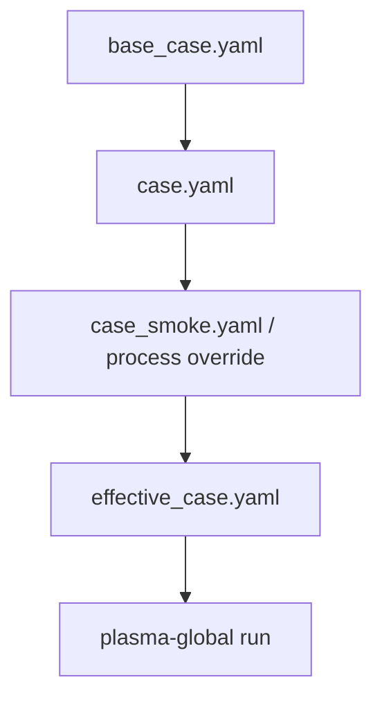

# 設定ガイド

YAML/CSV の必須項目、単位、よくある validation error は [入力 schema 早見表](SCHEMA_REFERENCE.md) にまとめています。このページでは case workflow と主要設定の意味を説明します。

## 推奨 case workflow

case は 3 層で管理するのが推奨です。

| 層 | 例 | 役割 |
|---|---|---|
| base | `base_case.yaml` | 共通 default |
| main | `case.yaml` | 主要な production / review case |
| override | `case_smoke.yaml`, process-specific case | smoke test や条件差し替え |

loader は次の include をサポートします。

```yaml
include: base_case.yaml
```



## `case.yaml` の主要セクション

| セクション | 役割 |
|---|---|
| `case` | case metadata |
| `files` | chamber、recipe、chemistry manifest、output、external input |
| `physics` | 物理モデルと主要 switch |
| `swarm` | EEDF/swarm 固有設定 |
| `numerics` | 積分器 tolerances、step、Jacobian、positivity |
| `outputs` | 出力形式、plot、diagnostics |
| `runtime` | effective config export などの run-control |

## `files`

重要な key は次の通りです。

- `chamber`
- `recipe`
- `chemistry.manifest`
- `output_dir`
- `external_inputs.*`

chemistry bundle は manifest で明示します。長期プロジェクトでは、暗黙のファイル探索より manifest の方がレビューしやすく壊れにくいです。

## `physics`

### 電気モデル

| Backend | 用途 |
|---|---|
| `direct_power` | 吸収パワーを直接与える |
| `dc_series_circuit` | 電圧源、ballast resistor、導電性 plasma load の reduced model |
| `external_circuit_table` | 測定値や SPICE 結果 CSV を一方向入力として読む |
| `rf_envelope` | HF/LF source と bias を RF 周期平均で扱う |
| `icp`, `ccp` | reduced source / bias proxy |

回路固有の設定は [CIRCUIT_COUPLING.md](CIRCUIT_COUPLING.md)、RF envelope 係数の較正は [RF_ENVELOPE_CALIBRATION.md](RF_ENVELOPE_CALIBRATION.md) を参照してください。

### 電子密度 closure

電子密度は EEDF closure とは別に設定します。

| Closure | 使う場面 | 注意 |
|---|---|---|
| `quasi_neutral` | 通常の global model | 電子密度は ODE state ではなく、ion charge balance から推定 |
| `prescribed_profile` | benchmark-driven chemistry、one-way coupling | CSV の `ne(t)` を EEDF/electrical coupling に渡す。自己無撞着 discharge ではない |
| `external_profile`, `profile` | alias | `prescribed_profile` と同義 |

例:

```yaml
files:
  external_inputs:
    electron_profile_csv: ../external/electron_density_profile.csv

physics:
  electron_density_closure: prescribed_profile

swarm:
  prescribed_electron_profile:
    file_key: electron_profile_csv
    density_column: electron_density_m3
    interpolation: linear
    hold: edge
```

profile CSV には `time_s` と、共通密度列または zone-specific 列が必要です。

```yaml
swarm:
  prescribed_electron_profile:
    file_key: electron_profile_csv
    zone_columns:
      plasma: ne_plasma_m3
      downstream: ne_downstream_m3
```

サポートされる共通列名の例は `electron_density_m3`, `ne_m3`, `electrons_m3`, `electron_density_cm3`, `ne_cm3`, `Electrons_cm-3` です。

## chamber zone の初期密度

gas species は通常、zone pressure と recipe の最初の gas mix から初期化されます。benchmark では特定 species だけ明示できます。

```yaml
zones:
  - zone_id: plasma
    pressure_Pa: 103548.675
    gas_temperature_K: 300.0
    initial_densities_m3:
      Ar: 2.5e25
      Ar_plus: 1.0e6
```

`e` はここに書かないでください。電子密度は quasi-neutral closure で荷電種から推定されます。

気体温度の reduced knob:

| Key | 意味 |
|---|---|
| `gas_heating_fraction` | 吸収 power のうち gas-temperature equation に入る割合 |
| `wall_relaxation_s_inv` | area-weighted wall temperature へ戻る一次緩和率 |

## surface model controls

| `surface.models.ion_loss` | 意味 |
|---|---|
| `bohm_edge_loss` | 現在の default positive-ion wall-loss closure |
| `bohm_global_loss` | edge-to-center correction を含む Bohm-family closure |
| `ambipolar_diffusion` | 一次 volumetric ion-loss mode |
| `off`, `none`, `disabled` | reduced ion-loss closure を無効化 |

Bohm-family と ambipolar-diffusion は同一 zone で混ぜないでください。同じ wall sink の二重計上を避けるため validation が拒否します。

Bohm-family の代表式は次の形です。

$$
\Gamma_i = h\,0.61\,n_i\sqrt{\frac{\varepsilon_e}{m_i}}
$$

ambipolar diffusion 型の一次損失は次の形です。

$$
\frac{dn_i}{dt} = -k_{\mathrm{loss}} n_i
$$

例:

```yaml
models:
  ion_loss: bohm_edge_loss
```

```yaml
models:
  ion_loss: ambipolar_diffusion
  diffusion_coefficient_m2_s: 1.0
  diffusion_length_m: 0.01
```

## `swarm`

有用な closure:

| Closure | 意味 |
|---|---|
| `auto` | 現在は internal global ODE で mean-energy closure に解決 |
| `mean_energy` | `We/ne` から求めた平均電子エネルギーで electron-impact rates を引く |
| `local_field` | electrical backend の reduced-field proxy で rates を引く。production では較正が必要 |

`swarm.prescribed_electron_profile` は `physics.electron_density_closure: prescribed_profile` のときだけ使われます。gas species の ODE state 構成は変えず、EEDF/electrical coupling と diagnostics に渡す電子密度だけを置き換えます。

## 再現性ファイル

各 run は次を出力できます。

| ファイル | 役割 |
|---|---|
| `effective_case.yaml` | include/override 解決後の実効 case |
| `resolved_paths.yaml` | 絶対パス map |

これらを output directory に書くことで、後から元の include chain が変わっても run の設定を追跡できます。
