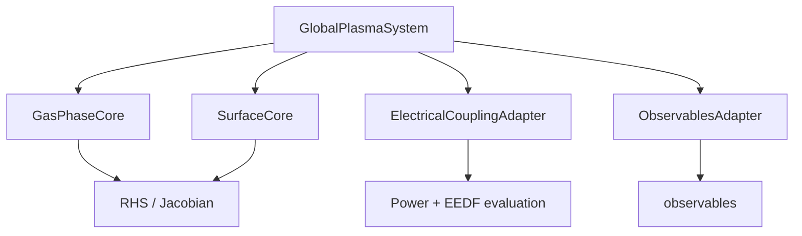

# core 分割リファクタリング

このメモは、以前の monolithic `GlobalPlasmaSystem` を 4 つの明示的 collaborator に分解した refactor を説明します。

## 新しい内部分割

## collaborator の責務

| Collaborator | 所有するもの | File |
|---|---|---|
| `GasPhaseCore` | gas-species state initialization、gas-phase reaction compilation、source terms、inlet/pump/inter-zone transport、electron/ion density reconstruction、gas-temperature source、gas-side Jacobian | `plasma_global/physics/gas_phase_core.py` |
| `SurfaceCore` | surface-reaction compilation、coverage projection、free-site reconstruction、wall inventory、film state、surface RHS/Jacobian、gas flux bookkeeping | `plasma_global/physics/surface_core.py` |
| `ElectricalCouplingAdapter` | `PowerRequest` と `EEDFRequest` の packaging、selected electrical/EEDF backend 呼び出し、per-zone coupled evaluation object | `plasma_global/electrical/coupling_adapter.py` |
| `ObservablesAdapter` | time-sampled engineering / plasma-physics observables、wafer/surface KPI、warning flag | `plasma_global/observables/adapter.py` |

## `GlobalPlasmaSystem` がまだ所有するもの

`GlobalPlasmaSystem` は time integrator から見える orchestration object です。まだ次を所有します。

- solver-facing public interface
- top-level state metadata
- immutable indexing information
- recipe-step lookup
- top-level state projection
- RHS / Jacobian / observables call の coordination

つまり solver API は変えずに、物理ロジックの集中を解消しています。

## この分割が重要な理由

| 視点 | 利点 |
|---|---|
| Architect | module ごとの cognitive load が下がり、責務境界が明確になる |
| Simulation engineer | source term の変更箇所、gas/surface/coupling の profile、block 単位の validation が見やすい |
| Plasma physicist | closure family を独立に差し替えやすく、どの近似が gas chemistry / sheath coupling に効くか監査しやすい |

## compatibility

refactor は次が使う外部 solver interface を維持します。

- `workflows/runner.py`
- `SciPyBDFIntegrator`
- existing YAML cases

後方互換の `_eval_power_and_eedf(...)` wrapper も残しており、古い analysis code は coupled evaluation tuple にアクセスできます。
