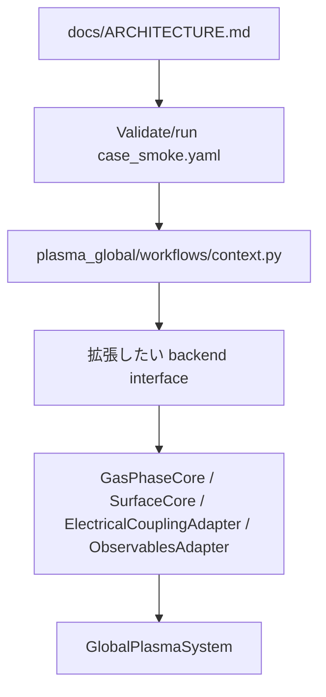

# 開発者ガイド

## 新しいコードを追加する場所

| 追加したいもの | 実装 | 登録 | ドキュメント |
|---|---|---|---|
| 新しい swarm model | `SwarmModel` | `SWARM_MODEL_REGISTRY` | case schema と関連 docs |
| 新しい electrical model | `ElectricalBackend` | `ELECTRICAL_REGISTRY` | `PowerRequest` metadata と assumptions |
| 新しい integrator | `TimeIntegrator` | `INTEGRATOR_REGISTRY` | numerics docs |

## 新規 contributor の推奨 review path



順番:

1. [ARCHITECTURE.md](ARCHITECTURE.md) を読む。
2. `examples/configs/case_smoke.yaml` を validate / run する。
3. `plasma_global/workflows/context.py` を読む。
4. 拡張したい backend interface を読む。
5. 関連する core collaborator を読む。
6. 最後に `GlobalPlasmaSystem` を読む。

## 保守ルール

- file I/O を `GlobalPlasmaSystem` に入れない。
- case loading を runner execution logic と混ぜない。
- physics choice は YAML で明示する。
- replaceable backend は stable request/result interface の後ろに置く。
- 新しい backend には maturity label と assumptions を付ける。
- optional dependency は、その feature が要求されるまで module import に入れない。
- 新しい近似は code comment だけでなく markdown に書く。

## internal core split の保守ルール

| 変更内容 | 置き場所 |
|---|---|
| gas species / transport source term | `GasPhaseCore` |
| coverage / film / wall kinetics | `SurfaceCore` |
| power / EEDF coupling orchestration | `ElectricalCouplingAdapter` |
| KPI と postprocessed warning | `ObservablesAdapter` |
| top-level orchestration | `GlobalPlasmaSystem` |

`GlobalPlasmaSystem` は orchestrator に留め、詳細 closure を蓄積する場所に戻さないでください。

## Jacobian checks

RHS または Jacobian code を変更したら finite-difference checker を使います。

```bash
plasma-global check-jacobian examples/configs/case_smoke.yaml --advance-s 1e-7 --top 8
```

診断コマンドです。reduced electrical backend derivative は analytic Jacobian にまだ含まれていないため、threshold を CI gate にする前に最大行を確認してください。

## pre-merge checklist

- `py -m plasma_global.cli validate examples/configs/case_smoke.yaml`
- `py -m plasma_global.cli run examples/configs/case_smoke.yaml`
- `py -m pytest`
- 新しい YAML key は [CONFIG_GUIDE.md](CONFIG_GUIDE.md) に書く。
- 新しい物理近似は [PHYSICS_MODELS_AND_APPROXIMATIONS.md](PHYSICS_MODELS_AND_APPROXIMATIONS.md) に書く。
- 新しい backend は `py -m plasma_global.cli list-backends` に出る。
