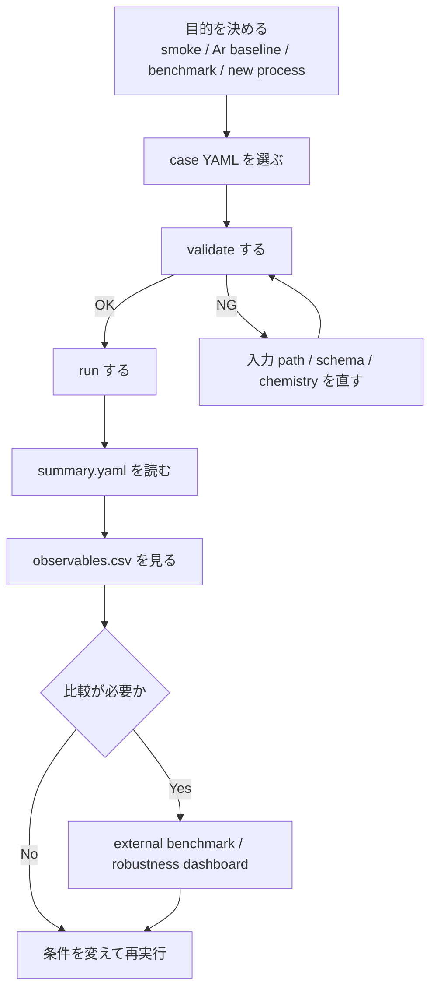
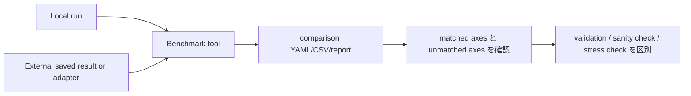

# 全体ワークフロー

## 最短の実行手順

具体的な smoke case の読み解きは [1 ケース walkthrough](QUICKSTART_CASE_WALKTHROUGH.md) にまとめています。

```powershell
py -m plasma_global.cli validate examples\configs\case_smoke.yaml
py -m plasma_global.cli run examples\configs\case_smoke.yaml
```

MkDocs でこのドキュメントを見る場合:

```powershell
py -m mkdocs serve
```

## 1 回の解析の流れ



## 目的別の入口

| 目的 | 最初に使う case / tool |
|---|---|
| まず動作確認したい | `examples/configs/case_smoke.yaml` |
| pure Ar の基準計算をしたい | `examples/configs/case_argon_lxcat.yaml` |
| ZDPlaskin example2 と比較したい | `examples/configs/case_zdplaskin_example2.yaml` |
| CRANE scalar ODE と比較したい | `examples/configs/case_crane_two_reaction_argon.yaml` |
| RF envelope 係数を試したい | `examples/configs/case_rf_envelope_calibration.yaml` |
| 外部 benchmark をまとめて走らせたい | `tools/external_benchmarks/run_external_benchmarks.py` |
| stress/applicability を見たい | `tools/external_benchmarks/robustness_dashboard.py` |

## 標準コマンド

| 作業 | コマンド |
|---|---|
| case validation | `py -m plasma_global.cli validate examples\configs\case_smoke.yaml` |
| case run | `py -m plasma_global.cli run examples\configs\case_smoke.yaml` |
| effective config export | `py -m plasma_global.cli export-config examples\configs\case.yaml tmp_case_dump` |
| backend 一覧 | `py -m plasma_global.cli list-backends` |
| Jacobian check | `py -m plasma_global.cli check-jacobian examples\configs\case_smoke.yaml --advance-s 1e-7 --top 8` |
| regression test | `py -m pytest` |
| MkDocs build | `py -m mkdocs build --strict` |

## 条件を変えるときの判断表

| 変えたいもの | 編集する場所 | 代表例 |
|---|---|---|
| pressure / flow / power timing | recipe YAML | `recipe_argon_lxcat.yaml` |
| zone volume / surface area / power port | chamber YAML | `chamber_argon_icp.yaml` |
| EEDF backend | case YAML の `physics` / `swarm` | `rate_table`, `boltzmann_2term` |
| electrical model | case YAML の `physics.electrical_backend` と `power_ports` | `direct_power`, `dc_series_circuit`, `rf_envelope` |
| species や reaction | chemistry CSV/YAML | `species.csv`, `gas_reactions.csv` |
| electron density を外部指定 | case YAML の `electron_density_closure` と profile CSV | `prescribed_profile` |
| output diagnostics | case YAML の `outputs.diagnostics` | reaction budget, state manifest |

## benchmark を読む流れ



benchmark はすべて同じ意味ではありません。

| 種類 | 例 | 読み方 |
|---|---|---|
| strict parity | ZDPlaskin example2 | 揃えた軸で final state が合うか |
| scalar ODE validation | CRANE TwoReactionArgon | reaction parsing、unit conversion、stiff ODE が合うか |
| sanity check | PyGMol Ar | trend と order of magnitude が妥当か |
| stress check | robustness sweep | 参照値との一致ではなく、有限・正・bounded か |

## レビュー時の確認順序

1. [全体像](OVERVIEW.md)
2. [モデルの入力と出力](MODEL_INPUT_OUTPUT.md)
3. [全体ワークフロー](END_TO_END_WORKFLOW.md)
4. [1 ケース walkthrough](QUICKSTART_CASE_WALKTHROUGH.md)
5. [入力 schema 早見表](SCHEMA_REFERENCE.md)
6. [出力の読み方](OUTPUT_READING_GUIDE.md)
7. [コードモジュール一覧](CODE_MODULES.md)
8. 目的に応じて benchmark または physics 詳細ページへ進む
