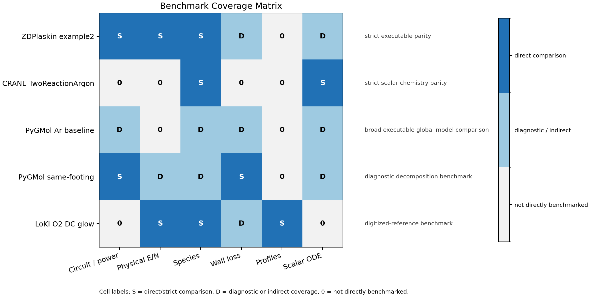

# 外部ベンチマーク

このページは、外部モデルとの比較結果を読むための入口です。目的は、コードがどの範囲で検証されているかを明確にし、strict validation と sanity check を混同しないことです。

## 結論

現時点で最も強い外部比較は ZDPlaskin example2 と CRANE TwoReactionArgon です。ZDPlaskin では Ar DC 放電の final state が数 % 程度で一致し、CRANE では 2 反応 Ar ODE の final density が非常に小さい相対誤差で一致します。

PyGMol 比較は別の性格を持ちます。PyGMol は one-zone の compact Ar global model であり、本コードの two-zone Ar LXCat case とは rate、wall loss、power deposition の仮定が異なります。この比較は「完全一致」を見るものではなく、差の主要因を分解するための sanity check です。

robustness sweep は accuracy benchmark ではありません。圧力、電圧、化学系を動かしたときに、解が有限・正・解釈可能な範囲に留まるかを見る適用範囲確認です。

## ベンチマークの位置づけ

| 比較 | 何を確認するか | 現在の読み方 |
|---|---|---|
| [ZDPlaskin example2](ZDPLASKIN_COMPARISON.md) | Ar DC-resistor 放電の species、E/N、電流、電力 | same-footing final-state parity として最も強い比較 |
| [CRANE TwoReactionArgon](CRANE_COMPARISON.md) | 2 反応 Ar scalar ODE、単位変換、stiff integration | 反応ネットワーク実装の切り出し検証 |
| [PyGMol Ar](ARGON_EXECUTABLE_COMPARISON.md) | pure-Ar global model の傾向、桁、差分要因 | executable sanity check。strict parity ではない |
| LoKI O2 DC glow | O2 benchmark 文献の主要量 | 文献 digitization に基づく参考比較 |
| [robustness sweep](ROBUSTNESS_BENCHMARKS.md) | 条件変更時の boundedness と table coverage | accuracy ではなく solver health の確認 |

この表のうち、シミュレーション精度の主張に直接使いやすいのは ZDPlaskin と CRANE です。PyGMol と robustness は、モデル仮定や適用範囲を理解するための補助情報として読んでください。

## 統合結果


左上の ZDPlaskin panel は、final species density と E/N の相対偏差を示します。主要量は数 % 程度に収まっており、この isolated Ar DC case では circuit、reaction balance、unit handling が整合していると読めます。

右上の CRANE panel は log scale の final-state relative error です。`e` と `Ar+` が同程度の誤差になるのは、2 反応 model で charged species balance が直接結びつくためです。ここでは electron energy、wall loss、電気回路は検証対象に含めていません。

PyGMol panel は、raw comparison と same-footing comparison の差を見ます。raw mismatch は solver failure ではなく、rate fit、absorbed power、wall loss、geometry が一致していないことを反映します。

LoKI panel は、O2 detailed chemistry の文献比較です。Ar baseline とは対象物理が異なるため、同じ合否基準では扱いません。

## 何が直接検証されているか



coverage matrix は、各 benchmark がどの物理軸を直接見ているかを整理したものです。`S` は比較軸として強く、`D` は診断的、`0` は直接見ていないことを意味します。

重要なのは、単一の benchmark が全物理を覆っていない点です。ZDPlaskin は circuit、E/N、species に強く、CRANE は scalar ODE と species に強い一方、wall loss や spatial profile はほとんど見ていません。PyGMol は global-model closure の差を調べるには有用ですが、strict validation ではありません。

## PyGMol の読み方


PyGMol 比較では、local/PyGMol ratio が 1 に近いほど対象 scalar が近いことを示します。ただし、raw PyGMol と local case は model form が違うため、raw ratio だけで合否を判断しません。

same-footing decomposition では、electron-impact rates、absorbed-power waveform、global ion wall-loss coefficient を順に揃えます。差が段階的に縮むなら、主な不一致は solver 実装ではなく、入力 physics closure の違いとして説明できます。最後に残る差は、one-zone と two-zone の構造差や残った closure 差として扱います。

## 実行

外部比較のまとめ:

```powershell
py tools\external_benchmarks\run_external_benchmarks.py --skip-zdplaskin-run
py tools\external_benchmarks\benchmark_dashboard.py
```

robustness / applicability dashboard:

```powershell
py tools\external_benchmarks\robustness_dashboard.py
```

代表的な出力は `examples/outputs/` と `tools/external_benchmarks/last_report.yaml` に保存されます。グラフは `examples/outputs/external_benchmark_dashboard/` で生成され、MkDocs 用には `docs/ja/assets/images/benchmarks/` に配置しています。

## 参考文献

| 対象 | 参考 |
|---|---|
| ZDPlasKin | [公式サイト](https://www.zdplaskin.laplace.univ-tlse.fr/), [example repository](https://github.com/Hemadityamalla/ZDPlaskin) |
| CRANE | [CRANE documentation](https://crane-plasma-chemistry.readthedocs.io/en/latest/), [Keniley and Curreli 2019](https://arxiv.org/abs/1905.10004) |
| PyGMol | [PyPI: pygmol](https://pypi.org/project/pygmol/) |
| LoKI O2 DC glow | [Viegas et al.](https://doi.org/10.1088/1361-6595/acbb9c), [arXiv:2210.16608](https://arxiv.org/abs/2210.16608) |
| Ar cross-section data | [Zenodo DOI 10.5281/zenodo.8192503](https://doi.org/10.5281/zenodo.8192503), [LXCat BOLSIG+ solver page](https://nl.lxcat.net/solvers/BolsigPlus/index.php?step=1) |
