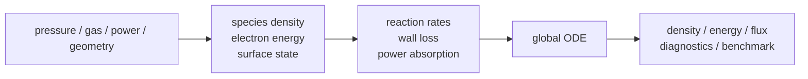

# 用語集と最小物理背景

このページは、プラズマ global model を読む前提として必要な用語と最小限の物理背景をまとめます。詳細な式と実装対応は [物理式・記号・実装対応表](PHYSICS_EQUATION_REFERENCE.md) を参照してください。

## まず押さえる全体像

global model は、装置内の空間分布を細かく解かず、zone ごとの平均量を時間発展として解くモデルです。

基本の読み方は次です。

| 見る量 | 意味 | 直感 |
|---|---|---|
| species density | どの粒子がどれだけあるか | 反応の材料と生成物 |
| electron density | 電子がどれだけあるか | 放電の立ち上がり、維持状態 |
| mean electron energy | 電子がどれだけ反応を起こしやすいか | rate table を引く代表量 |
| absorbed power | plasma に実際に入った電力 | 電子エネルギーの供給源 |
| E/N | 電場を中性粒子密度で割った量 | 電子衝突 rate の代表軸 |
| ion flux | 壁や wafer に届く ion の流束 | surface process の入口 |

## 最小の数式

species balance は「生成、損失、流入出、壁とのやり取り」の合計として読みます。

$$
\frac{dn_s}{dt}
  = P_s - L_s + T_s + F_s
$$

電子密度は、多くの case で独立 state ではなく quasi-neutrality から決まります。

$$
n_e = \max\left(\sum_i z_i n_i,\ n_{\min}\right)
$$

平均電子エネルギーは、electron energy density を電子密度で割って得ます。

$$
\langle\varepsilon\rangle = \frac{W_e}{n_e}
$$

reduced field は、電場を中性粒子密度で割ったものです。

$$
E/N = \frac{|V|/d}{N},\qquad N = \frac{p}{k_B T_g}
$$

## 用語集

| 用語 | 意味 | この repo で見る場所 |
|---|---|---|
| global model | 空間平均された plasma model | [全体像](OVERVIEW.md) |
| zone | 平均量を持つ計算領域 | chamber YAML, [モデルの入力と出力](MODEL_INPUT_OUTPUT.md) |
| surface | wall / wafer などの境界面 | chamber YAML, surface diagnostics |
| species | Ar, Ar+, e などの粒子種 | chemistry `species.csv` |
| reaction | species を生成/消費する式 | `gas_reactions.csv`, `surface_reactions.csv` |
| state vector | ODE solver が積分する変数の配列 | [state vector の読み方](STATE_VECTOR_GUIDE.md) |
| quasi-neutrality | 正電荷密度から電子密度を代数的に決める近似 | [物理モデルと近似](PHYSICS_MODELS_AND_APPROXIMATIONS.md) |
| EEDF | electron energy distribution function | EEDF backend |
| rate coefficient | 反応速度を決める係数 | chemistry model / EEDF table |
| swarm closure | rate/transport を平均エネルギーや E/N から引く方法 | case YAML `swarm` |
| E/N | reduced electric field | `EoverN_*_Td`, port diagnostics |
| absorbed power | plasma に吸収された電力 | `total_absorbed_power_W`, `port_*_absorbed_power_W` |
| delivered power | generator/backend から与えた電力 | `port_*_delivered_power_W` |
| Bohm loss | ion が壁へ失われる reduced wall-loss 近似 | surface `models.ion_loss` |
| ambipolar diffusion | charged particle の拡散損失近似 | surface `models.ion_loss` |
| IED | ion energy distribution | `ied_*`, `mean_ion_energy_*` |
| benchmark parity | 条件を揃えた比較で主要量が一致すること | [ベンチマーク判定基準](BENCHMARK_ACCEPTANCE_GUIDE.md) |
| stress check | 参照解との一致ではなく、破綻しないことの確認 | robustness benchmark |

## 読む順番の目安

| 読者 | 最初に読むページ |
|---|---|
| モデルの全体像を知りたい | [全体像](OVERVIEW.md) -> [モデルの入力と出力](MODEL_INPUT_OUTPUT.md) |
| 出力を解釈したい | [出力の読み方](OUTPUT_READING_GUIDE.md) -> [observables.csv 列辞書](OBSERVABLES_COLUMN_REFERENCE.md) |
| 数式とコードの対応を見たい | [物理式・記号・実装対応表](PHYSICS_EQUATION_REFERENCE.md) |
| benchmark の意味を判断したい | [ベンチマーク判定基準](BENCHMARK_ACCEPTANCE_GUIDE.md) |

## よくある誤解

| 誤解 | 実際 |
|---|---|
| `success: true` なら物理的に正しい | 数値積分が終わったという意味。物理妥当性は diagnostics と benchmark で確認する |
| electron density は常に ODE state | 多くの case では quasi-neutrality から代数的に決まる |
| absorbed power と delivered power は同じ | electrical backend の coupling により異なることがある |
| stress benchmark は accuracy validation | stress check は solver health と適用範囲の確認であり、外部参照との厳密一致ではない |
| ZDPlaskin parity が全 case の精度を保証する | example2 と同じ footing の final-state parity を示すだけ |
