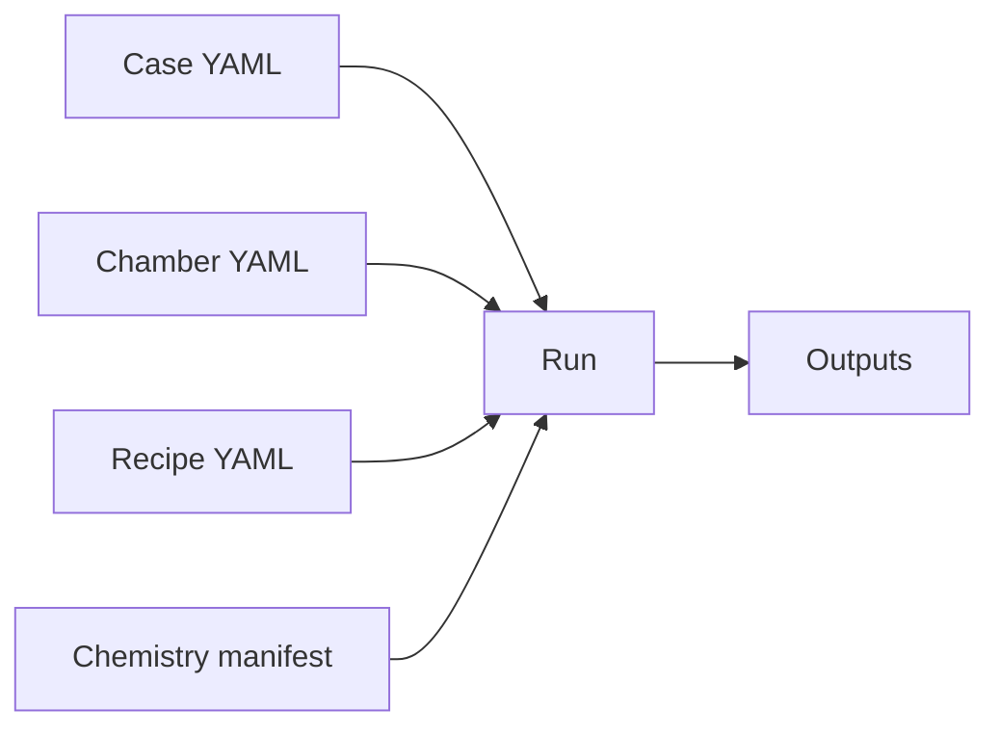

# 入出力仕様

run 後に何をどの順番で読むかは [出力の読み方](OUTPUT_READING_GUIDE.md) を先に見ると把握しやすいです。このページでは各出力ファイルの役割を整理します。`observables.csv` の列名は [observables.csv 列辞書](OBSERVABLES_COLUMN_REFERENCE.md)、`state_manifest.yaml` は [state vector の読み方](STATE_VECTOR_GUIDE.md) も参照してください。

## 主要入力

| 入力 | 内容 |
|---|---|
| Case YAML | path、physics selection、numerics、outputs、runtime behavior |
| Chamber YAML | zones、edges、surfaces、inlets、pumps、power ports |
| Recipe YAML | time-ordered recipe steps |
| Chemistry manifest YAML | chemistry file bundle |



## 主要出力

| 出力 | 役割 |
|---|---|
| `solution.h5` | raw state history と diagnostics |
| `observables.csv` | 時系列の工学・物理 derived quantities |
| `summary.yaml` | run 末尾と step ごとの compact summary |
| `reaction_budget.yaml` | final saved state の gas-phase reaction / ion wall-loss budget |
| `electron_energy_budget.yaml` | final saved state の electron energy-density budget |
| `surface_reaction_budget.yaml` | surface reaction、gas flux、coverage、film growth budget |
| `state_manifest.yaml` | 実際の ODE state vector manifest |
| `run_provenance.yaml` | 入力、backend、metadata、validation message の provenance |
| `effective_case.yaml` | 解決済み case configuration |
| `resolved_paths.yaml` | run で使った絶対パス map |

## `observables.csv`

electrical backend が numeric `PowerResult.metadata["port_details"]` を公開すると、power-port diagnostics は次の列名で展開されます。

```text
port_<port_id>_<metric>
```

例:

- `port_source_rf_absorbed_power_W`
- `port_dc_drive_gap_voltage_V`
- `port_dc_drive_current_A`
- `port_lf_bias_self_bias_V`

backend name や file path のような text metadata は主時系列 table には展開しません。

## `summary.yaml`

core plasma observables と、一部の power-port diagnostics について final / per-step statistics を持つ compact summary です。対象は absorbed/delivered power、frequency、voltage、current、self-bias、plasma potential、coupling efficiency、reduced field、plasma resistance などです。

backend 固有のより詳細な diagnostics は `observables.csv` に残します。

## diagnostic budgets

### `reaction_budget.yaml`

case ごとに有効化します。

```yaml
outputs:
  diagnostics:
    reaction_budget:
      enabled: true
      species: [Ar_star, Ar_plus, Ar2_plus]
      max_reactions_per_species: 6
```

zone/species ごとに total production、total loss、net rate、主要な production/loss contributor を出します。dense time series ではなく mechanism review 用です。

### `electron_energy_budget.yaml`

```yaml
outputs:
  diagnostics:
    electron_energy_budget:
      enabled: true
      max_reactions: 8
```

absorbed power density、electron-impact energy loss、positive-ion wall energy loss、pump/edge electron-energy transport、dominant loss reactions を報告します。符号はファイル内で明示され、正は electron energy density を増やし、負は取り除きます。

### `surface_reaction_budget.yaml`

```yaml
outputs:
  diagnostics:
    surface_reaction_budget:
      enabled: true
      max_reactions_per_species: 6
```

surface ごとに coverage production/loss、surface への gas flux、film growth rate、reaction rate を報告します。surface reaction がない case でも小さな surface inventory summary は出せます。

## `state_manifest.yaml`

```yaml
outputs:
  diagnostics:
    state_manifest:
      enabled: true
```

state-vector index を label、unit、zone/surface、species metadata に対応付けます。loaded chemistry、chamber、physics switch から生成するため、手書き state list を二重管理する必要がありません。

含まれる主な情報:

| Section | 内容 |
|---|---|
| `species_catalog` | species が state、algebraic、externally prescribed、metadata-only のどれか |
| `electron_density` | electron density closure の説明 |
| `state_groups` | downstream tool 用の slice boundary |

## `run_provenance.yaml`

```yaml
outputs:
  diagnostics:
    provenance:
      enabled: true
      filename: run_provenance.yaml
```

resolved input paths、selected physics backends、EEDF/rate table provenance、chemistry cross-section metadata、selected rate-model metadata、chamber power-port settings、backend class、validation messages を記録します。

## raw と derived を分ける理由

`solution.h5` は authoritative numerical result です。CSV と YAML は reviewer-facing summary です。この分離により、debug と process interpretation を混ぜずに扱えます。
