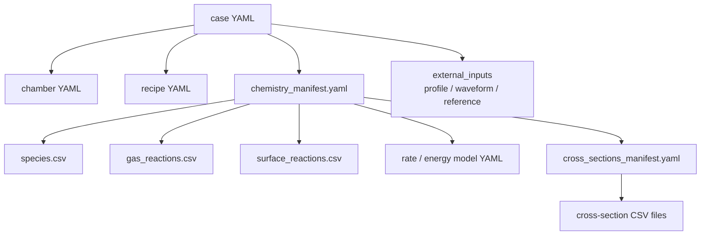
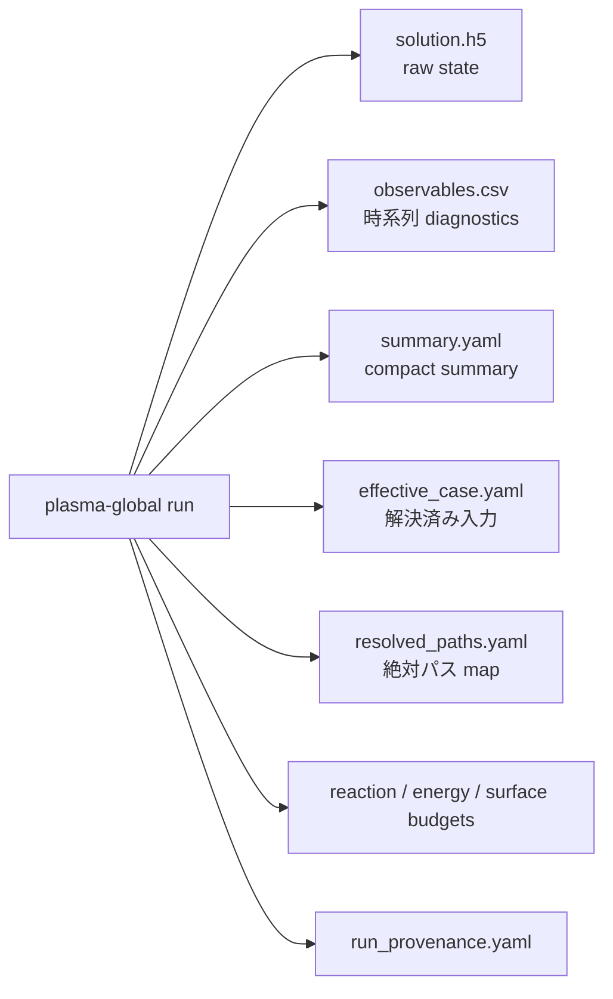

# モデルの入力と出力

実際の case を入力から出力まで追う場合は [1 ケース walkthrough](QUICKSTART_CASE_WALKTHROUGH.md)、YAML/CSV の必須項目と単位を確認する場合は [入力 schema 早見表](SCHEMA_REFERENCE.md)、run 後の読み順は [出力の読み方](OUTPUT_READING_GUIDE.md) を参照してください。ODE が実際に積分する state の中身は [state vector の読み方](STATE_VECTOR_GUIDE.md) で確認できます。

## 入力ファイルの全体像

1 回の simulation は、複数の小さな入力ファイルを `case YAML` が束ねる構造です。



## まず見る入力

| 知りたいこと | 見るファイル |
|---|---|
| この run は何を読むか | `examples/configs/case_*.yaml` |
| zone、体積、面積、surface、power port は何か | `examples/configs/chamber_*.yaml` |
| 時間 step、pressure、flow、power は何か | `examples/configs/recipe_*.yaml` |
| species と反応セットは何か | `examples/chemistry_*/chemistry_manifest.yaml` |
| 電子衝突 rate はどこから来るか | `cross_sections_manifest.yaml` または rate table |
| 外部電子密度 profile や回路波形を使うか | `files.external_inputs` |

## 代表的な入力 bundle

pure Ar LXCat baseline の例です。

```text
examples/configs/case_argon_lxcat.yaml
examples/configs/chamber_argon_icp.yaml
examples/configs/recipe_argon_lxcat.yaml
examples/chemistry_argon_lxcat/
  chemistry_manifest.yaml
  species.csv
  gas_reactions.csv
  surface_reactions.csv
  reaction_models.yaml
  cross_sections_manifest.yaml
  cross_sections/*.csv
```

ZDPlaskin parity case の例です。

```text
examples/configs/case_zdplaskin_example2.yaml
examples/configs/chamber_zdplaskin_example2.yaml
examples/configs/recipe_zdplaskin_example2.yaml
examples/chemistry_zdplaskin_example2/
examples/outputs/zdplaskin_example2_surrogate/
```

## case YAML が答えること

| セクション | 答える問い |
|---|---|
| `case` | この simulation の名前や metadata は何か |
| `files` | 入力ファイルと出力先はどこか |
| `physics` | どの EEDF/electrical/electron-density closure を使うか |
| `swarm` | rate table や EEDF backend の設定は何か |
| `numerics` | ODE solver tolerance や step 制御は何か |
| `outputs` | どの diagnostics を書くか |
| `runtime` | effective config export などを行うか |

## 出力ファイルの全体像



## 最初に読む出力

| 優先 | 出力 | 読む理由 |
|---:|---|---|
| 1 | `summary.yaml` | run が終わったか、主要量の最終値と step summary を確認 |
| 2 | `observables.csv` | 時系列で電子密度、power、field、flux を確認 |
| 3 | `effective_case.yaml` | include/override 後に実際に使われた設定を確認 |
| 4 | `resolved_paths.yaml` | 入力ファイルの解決先を確認 |
| 5 | `reaction_budget.yaml` | どの反応が species を作る/失うか確認 |
| 6 | `electron_energy_budget.yaml` | electron energy の gain/loss を確認 |
| 7 | `state_manifest.yaml` | ODE state vector の中身を確認。読み方は [state vector の読み方](STATE_VECTOR_GUIDE.md) |
| 8 | `solution.h5` | raw state history を解析する |

## 出力の読み方の目安

| 状況 | 最初に確認するもの |
|---|---|
| run が失敗する | `effective_case.yaml`, validation message, `resolved_paths.yaml` |
| electron density が異常 | `observables.csv`, `reaction_budget.yaml`, ion loss diagnostics |
| power が想定と違う | `summary.yaml`, `port_<port_id>_*` columns |
| rate table 範囲が怪しい | E/N diagnostics, rate table metadata |
| 外部比較が合わない | benchmark report と same-footing axes |

## 入力から出力までの責務分担

| 段階 | 主な module | 役割 |
|---|---|---|
| 入力解決 | `plasma_global.config` | YAML include、path resolution、schema validation |
| chemistry 読み込み | `plasma_global.chemistry` | species/reaction/rate/cross-section validation |
| chamber/recipe 読み込み | `plasma_global.reactor` | zone、surface、flow、port の構造化 |
| model 組み立て | `plasma_global.workflows` | backend 選択と ODE system 構築 |
| ODE 解法 | `plasma_global.numerics` | state layout、RHS、Jacobian、integrator |
| diagnostics | `plasma_global.observables`, `plasma_global.diagnostics` | observables、budget、provenance |
