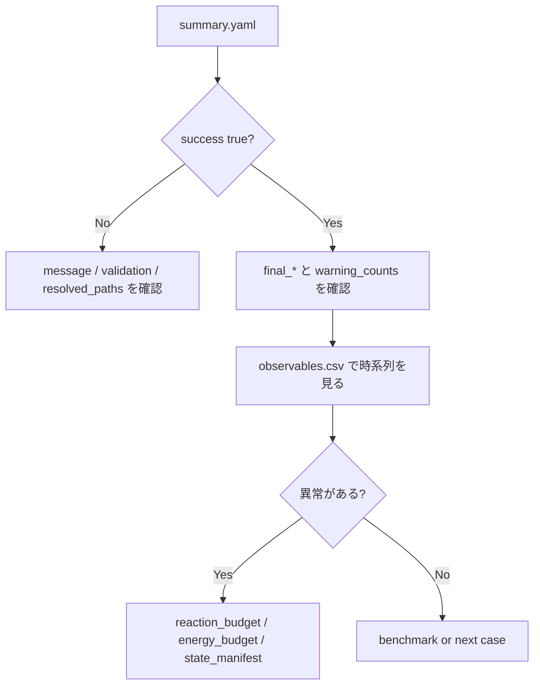

# 出力の読み方

このページは、run 後に生成されるファイルを「どの順番で、何を判断するために読むか」に絞って説明します。詳細なファイル一覧は [入出力仕様](IO_SPEC.md)、`observables.csv` の列名辞書は [observables.csv 列辞書](OBSERVABLES_COLUMN_REFERENCE.md) を参照してください。

## 最初の 5 分で見る順番



## `summary.yaml`

`summary.yaml` は最初に読む compact summary です。smoke case では次のような key が出ます。

```yaml
success: true
message: The solver successfully reached the end of the integration interval.
n_times: 200
t_end_s: 1.0e-06
final_electron_density_m3: 3.2007e14
final_mean_electron_energy_eV: 2.408
final_port_source_rf_absorbed_power_W: 55.49
final_port_source_rf_delivered_power_W: 300.0
warning_counts:
  warning_debye_ratio_process: 49
```

| Key pattern | 読み方 |
|---|---|
| `success`, `status`, `message` | solver が最後まで到達したか |
| `n_times`, `t_start_s`, `t_end_s` | 保存点数と simulation 時間 |
| `final_*` | 最終時刻の代表値 |
| `step_summary.*` | recipe step ごとの mean/final/min/max |
| `warning_counts.*` | warning が何回立ったか |

注意:

- `success: true` は「数値的に最後まで到達した」という意味です。物理的に妥当とは限りません。
- `warning_counts` は regime check です。warning がある場合は、該当列を `observables.csv` で時系列確認します。
- smoke case の warning は、workflow 確認用 case では許容されることがあります。

## `observables.csv`

`observables.csv` は時系列 diagnostics です。列数が多いため、まず列名の pattern で読みます。
列名ごとの詳しい意味は [observables.csv 列辞書](OBSERVABLES_COLUMN_REFERENCE.md) にまとめています。

| Pattern | 例 | 意味 |
|---|---|---|
| global | `electron_density_m3`, `mean_electron_energy_eV` | 代表量 |
| zone | `ne_source_m3`, `EoverN_process_Td` | zone 別量 |
| port | `port_source_rf_absorbed_power_W` | power port diagnostics |
| surface | `ion_flux_wafer_m2_s`, `film_wafer_m` | 表面・ウェハ diagnostics |
| warning | `warning_debye_ratio_process` | warning flag |

最初に見る列:

| 列 | 判断 |
|---|---|
| `time_s` | 時間範囲と保存点が想定通りか |
| `step_id` | recipe step が想定通り切り替わるか |
| `electron_density_m3` | finite / positive / order が自然か |
| `mean_electron_energy_eV` | power on/off に対して自然に変化するか |
| `total_absorbed_power_W` | command に対して backend がどれだけ吸収させたか |
| `EoverN_*_Td` | rate table の範囲外に出ていないか |
| `warning_*` | いつ warning が立つか |

## power port diagnostics

列名:

```text
port_<port_id>_<metric>
```

例:

| 列 | 読み方 |
|---|---|
| `port_source_rf_delivered_power_W` | recipe/backend に渡した power |
| `port_source_rf_absorbed_power_W` | plasma に入った absorbed power |
| `port_source_rf_coupling_efficiency` | delivered から absorbed への効率 |
| `port_wafer_bias_rf_voltage_rms_V` | bias port の RMS voltage |
| `port_wafer_bias_self_bias_V` | self-bias proxy |

delivered power と absorbed power が大きく違う場合、backend の coupling efficiency や plasma load model を確認します。

## warning の読み方

| Warning | 意味 | 最初に確認するもの |
|---|---|---|
| `warning_debye_ratio_*` | Debye length と characteristic length の比が大きい | `debye_length_*_m`, density, temperature |
| `warning_high_electronegativity_*` | electronegativity が高い | ion/electron density、negative ion chemistry |
| `warning_ion_ion_afterglow_*` | afterglow で ion-ion condition が強い | power off step、charged species |
| `warning_pressure_deviation_*` | pressure が target からずれる | pump / inlet / total density |
| `warning_site_overfill_*` | surface site が過充填 | coverage、surface reaction |
| `warning_site_depletion_*` | free site が枯渇 | coverage、surface reaction |

warning は失敗ではなく、解釈時の注意信号です。benchmark や production 解釈では、warning がどの時間帯に立つかを確認してください。

## budget files

| File | 使う場面 |
|---|---|
| `reaction_budget.yaml` | density の増減を支配する反応を知りたい |
| `electron_energy_budget.yaml` | electron energy がどこで増減しているか知りたい |
| `surface_reaction_budget.yaml` | surface coverage、film、wall flux を確認したい |
| `state_manifest.yaml` | ODE state vector の index と species 対応を見たい。読み方は [state vector の読み方](STATE_VECTOR_GUIDE.md) |
| `run_provenance.yaml` | backend、rate table、input provenance を確認したい |

## よくある異常と次に見るもの

| 症状 | 次に見るもの |
|---|---|
| `success: false` | `message`、solver tolerances、validation output |
| electron density が floor 付近のまま | ionization rates、absorbed power、reaction budget |
| electron energy が極端に高い | EEDF/rate table 範囲、energy loss models、power coupling |
| absorbed power が command と合わない | electrical backend、port diagnostics、coupling efficiency |
| E/N が table 範囲外 | `EoverN_*_Td`、rate table metadata、electrical settings |
| surface coverage が 0/1 に張り付く | surface reaction budget、site density、sticking |
| external benchmark が合わない | matched/unmatched axes、same-footing report |

## benchmark 出力の読み方

benchmark 結果は「何を証明するか」が case によって違います。
合格基準と非保証範囲は [ベンチマーク判定基準](BENCHMARK_ACCEPTANCE_GUIDE.md) を先に見ると誤解しにくくなります。

| Benchmark | 出力 | 読み方 |
|---|---|---|
| ZDPlaskin | comparison YAML / same-footing report | final E/N、circuit、species の parity |
| CRANE | comparison YAML | reaction parsing、unit conversion、stiff ODE |
| PyGMol | summary CSV / metadata | trend と order of magnitude |
| robustness | dashboard / summary CSV | finite、positive、bounded、rate-table coverage |

strict validation と stress check を混同しないことが重要です。
