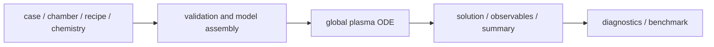

# 全体像

## このコードの位置づけ

このリポジトリは、低圧プラズマを 0D/global model として扱うためのシミュレーションコードです。反応容器を 1 つまたは複数の well-mixed zone として表し、gas species、charged species、electron energy、surface state の時間発展を stiff ODE として解きます。

使い方は、装置条件と反応機構を入力ファイルで与え、計算結果を時系列 diagnostics と budget として読む、という流れです。装置全体の平均的な粒子 balance、電力 balance、壁損失、表面反応の寄与を調べることに向いています。

## 解いている式

各 species の密度は、gas reaction、surface reaction、transport、wall loss を合わせた balance として扱います。

$$
\frac{dn_s}{dt}
= S_s^{\mathrm{gas}}
+ S_s^{\mathrm{surface}}
+ S_s^{\mathrm{transport}}
+ S_s^{\mathrm{wall}}
$$

電子エネルギーは、吸収電力と衝突損失、壁損失、輸送損失の balance として扱います。

$$
\frac{dW_e}{dt}
= P_{\mathrm{abs}}
- L_{\mathrm{inelastic}}
- L_{\mathrm{wall}}
- L_{\mathrm{transport}}
$$

electron-impact rate は、平均電子エネルギー、reduced field、または rate table から取得します。

$$
k_j = k_j(\langle\varepsilon\rangle)
\quad \mathrm{or} \quad
k_j = k_j(E/N)
$$

このため、出力の信頼性は chemistry data、rate closure、wall model、electrical backend の妥当性に強く依存します。

## 入力と出力

入力は複数のファイルに分かれます。`case YAML` が全体を束ね、chamber、recipe、chemistry bundle、physics backend、numerics、output options を指定します。

| 入力 | 役割 |
|---|---|
| case YAML | 1 回の simulation の top-level 設定 |
| chamber YAML | zone、volume、surface、port、pump などの装置構造 |
| recipe YAML | pressure、flow、power、step duration などの時間条件 |
| chemistry bundle | species、gas reaction、surface reaction、rate model、cross sections |
| physics backend | EEDF/rate closure、electrical closure、electron density closure |

出力は、raw state と読みやすい diagnostics に分かれます。

| 出力 | 主な用途 |
|---|---|
| `summary.yaml` | run の成否、最終値、step summary を確認 |
| `observables.csv` | electron density、power、E/N、flux などの時系列を確認 |
| `solution.h5` | ODE state の raw history を解析 |
| `reaction_budget.yaml` | species source / loss の支配反応を確認 |
| `electron_energy_budget.yaml` | electron energy の gain / loss を確認 |
| `state_manifest.yaml` | state vector の index と物理量を確認 |

## 計算できる範囲

このコードが得意なのは、装置平均の反応・輸送・壁損失のバランスを見る計算です。たとえば、Ar、CF4、O2 を含む反応セットを使った transient global simulation、DC/pulsed-DC/RF envelope 的な power input、surface reaction や wafer flux proxy の出力が扱えます。

一方、次のものは直接解きません。

| 対象 | 扱い |
|---|---|
| 2D/3D plasma fluid | 空間分布は解かず、zone-average として扱う |
| PIC/MCC | particle simulation ではない |
| full Boltzmann equation | rate / EEDF backend の要約値を使う |
| electromagnetic field solver | 電場・電力結合は簡約 backend として扱う |
| time-resolved RF sheath | RF envelope や sheath proxy として近似する |

この制限は欠点というより、global model としての前提です。空間分布や sheath dynamics が主目的であれば、別のモデルとの併用が必要です。

## 検証済みの範囲

現時点では、外部比較と stress check を分けて扱っています。

| 種類 | 内容 | 現在の結論 |
|---|---|---|
| ZDPlaskin comparison | Ar DC-resistor discharge の final species、E/N、電流、電力 | same-footing final state が数 % 程度で一致 |
| CRANE comparison | 2 反応 Ar scalar ODE | 単位変換、stoichiometry、stiff integration が整合 |
| PyGMol comparison | pure-Ar executable global model | strict parity ではなく、rate / power / wall loss 差の診断 |
| robustness sweep | pressure、voltage、chemistry family の perturbation | 選んだ stress cases では finite / positive / bounded を確認 |

この結果から、限定された条件では ODE assembly、reaction handling、unit conversion、簡約 circuit coupling、diagnostics が整合していると言えます。ただし、すべての plasma condition で予測精度が確認済みという意味ではありません。

## まだ足りない検証

今後必要なのは、より広い operating regime に対する reference です。特に、RF/ICP/CCP 条件、mixed gas chemistry、surface reaction、wafer flux、IED proxy については、外部 solver、高忠実度計算、または実験データとの比較が必要です。

rate table や cross-section data の不確かさも、process prediction では支配的になり得ます。したがって、未知条件での絶対値を主張する場合は、追加 benchmark と感度評価を合わせて行う必要があります。

## 次に読むページ

- [モデルの入力と出力](MODEL_INPUT_OUTPUT.md): 入力ファイルと出力ファイルの対応。
- [全体ワークフロー](END_TO_END_WORKFLOW.md): validate、run、diagnostics、benchmark の手順。
- [出力の読み方](OUTPUT_READING_GUIDE.md): 結果ファイルを読む順番。
- [外部ベンチマーク](EXTERNAL_BENCHMARKS.md): benchmark 結果と検証範囲。
- [モデル成熟度](MODEL_MATURITY.md): backend ごとの成熟度と注意点。
