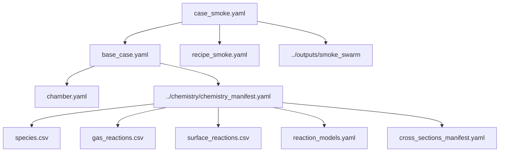

# 1 ケースの読み解き

このページでは、`case_smoke.yaml` を使って入力から出力までを 1 本で確認します。目的は、このコードが何を読み、何を組み立て、何を出力するかを実ファイル名で把握することです。

## 対象 case

```text
examples/configs/case_smoke.yaml
```

この case は `base_case.yaml` を include し、recipe と output directory だけを smoke test 用に上書きします。

```yaml
include: base_case.yaml

case:
  name: smoke_swarm

files:
  recipe: recipe_smoke.yaml
  output_dir: ../outputs/smoke_swarm

outputs:
  plots:
    enabled: false

numerics:
  max_step: 1.0e-7
```

## 入力解決の流れ



実際に解決されたパスは run 後の `resolved_paths.yaml` で確認できます。

```yaml
source_config: ...\examples\configs\case_smoke.yaml
chamber_file: ...\examples\configs\chamber.yaml
recipe_file: ...\examples\configs\recipe_smoke.yaml
chemistry_manifest: ...\examples\chemistry\chemistry_manifest.yaml
output_dir: ...\examples\outputs\smoke_swarm
```

## validate する

```powershell
py -m plasma_global.cli validate examples\configs\case_smoke.yaml
```

ここで確認される代表項目です。

| 確認項目 | 例 |
|---|---|
| YAML schema | required key があるか |
| path resolution | chamber、recipe、chemistry manifest が見つかるか |
| chemistry validation | species、reaction equation、charge/element conservation |
| backend selection | EEDF、electrical、integrator が registry に存在するか |

validate が通らない場合は、まず `files.*` の path と `chemistry_manifest.yaml` の参照先を確認します。

## run する

```powershell
py -m plasma_global.cli run examples\configs\case_smoke.yaml
```

出力先:

```text
examples/outputs/smoke_swarm/
```

主な出力:

| 出力 | 最初に見る理由 |
|---|---|
| `summary.yaml` | run 成功、最終値、step summary |
| `observables.csv` | 時系列の電子密度、電力、field、surface diagnostics |
| `effective_case.yaml` | include/override 後に実際に使われた設定 |
| `resolved_paths.yaml` | 入力ファイルの絶対パス |
| `solution.h5` | raw state history |

## `summary.yaml` を読む

smoke case の代表的な summary は次のような構造です。

```yaml
success: true
message: The solver successfully reached the end of the integration interval.
n_times: 200
t_start_s: 0.0
t_end_s: 1.0e-06
final_electron_density_m3: 3.2007e14
final_mean_electron_energy_eV: 2.408
final_port_source_rf_absorbed_power_W: 55.49
final_port_source_rf_delivered_power_W: 300.0
warning_counts:
  warning_debye_ratio_process: 49
  warning_debye_ratio_source: 26
```

読み方:

| Key | 意味 |
|---|---|
| `success` | ODE solver が最後まで到達したか |
| `n_times` | 保存された時刻点数 |
| `final_electron_density_m3` | 最終時刻の代表電子密度 |
| `final_mean_electron_energy_eV` | 最終時刻の平均電子エネルギー |
| `final_port_*` | electrical backend が出した port diagnostics |
| `warning_counts` | model-regime warning の回数 |

`warning_debye_ratio_*` が出ていても、即座に失敗とは限りません。smoke case は「実行経路の確認」が主目的であり、process validation ではありません。

## `observables.csv` を読む

最初に見る列:

| 列 | 意味 |
|---|---|
| `time_s` | 時刻 |
| `step_id` | recipe step |
| `electron_density_m3` | 代表電子密度 |
| `mean_electron_energy_eV` | 代表平均電子エネルギー |
| `total_absorbed_power_W` | total absorbed power |
| `ne_source_m3`, `ne_process_m3` | zone 別電子密度 |
| `EoverN_source_Td`, `EoverN_process_Td` | zone 別 reduced field |
| `ion_flux_wafer_m2_s` | wafer への ion flux |
| `warning_*` | diagnostics warning |

列名の規則:

```text
port_<port_id>_<metric>
<quantity>_<zone_id>_<unit>
<quantity>_<surface_id>_<unit>
```

例:

```text
port_source_rf_absorbed_power_W
ne_process_m3
ion_flux_wafer_m2_s
```

## この case で分かること / 分からないこと

| 分かること | 分からないこと |
|---|---|
| YAML include と path resolution が動くか | 実プロセス精度 |
| chemistry bundle が読み込めるか | 実験との一致 |
| EEDF/electrical/numerics の基本連携が動くか | RF sheath の詳細 |
| 出力ファイルが一式生成されるか | 2D/3D 空間分布 |

この smoke case で実行経路を確認した後、目的に応じて `case_argon_lxcat.yaml`、`case_zdplaskin_example2.yaml`、または benchmark dashboard に進むのが自然です。
