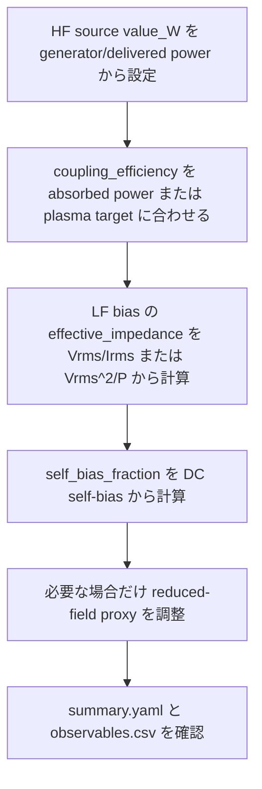

# RF envelope 較正

## 範囲

`rf_envelope` は HF/LF 入力を RF 周期平均で扱う model です。global plasma model に recipe-scale absorbed power、RMS voltage、self-bias、任意の reduced-field proxy を見せたいときに使います。

外部回路連携は future-entry stage に留めています。`external_circuit_table` は測定または SPICE 生成 waveform CSV を一方向に読めますが、full ngspice execution、plasma-to-circuit feedback、tight circuit/plasma DAE coupling は将来作業です。

## 係数の意味

| Parameter | 目的 | 主な観測量 |
|---|---|---|
| `coupling_efficiency` | generator / delivered power を plasma absorbed power に変換 | absorbed power、electron density |
| `effective_impedance_ohm` | voltage-driven port の power/current 換算 | RMS voltage/current |
| `self_bias_fraction` | LF/bias port の DC self-bias proxy | measured DC self-bias |
| `base_reduced_field_Td`, `reduced_field_per_sqrt_W_Td` | local-field study 用 E/N proxy | reduced field trend |

## `coupling_efficiency`

$$
\eta_c = \frac{P_{\mathrm{absorbed}}}{P_{\mathrm{commanded}}}
$$

初期範囲:

| Port role | 推奨開始範囲 |
|---|---:|
| HF source / ICP-like source | `0.30` から `0.90` |
| LF bias / CCP-like bias | `0.05` から `0.60` |

absorbed power が測定されている場合はそこから始めます。forward/reflected power だけがある場合は net delivered power を command とし、electron density、mean energy、total ionization balance に合わせて efficiency を調整します。

## `effective_impedance_ohm`

voltage-driven port では次を使います。

$$
P_{\mathrm{commanded}} = \frac{V_{\mathrm{rms}}^2}{Z_{\mathrm{eff}}}
$$

$$
I_{\mathrm{rms}} = \frac{V_{\mathrm{rms}}}{Z_{\mathrm{eff}}}
$$

推奨初期推定:

$$
Z_{\mathrm{eff}} = \frac{V_{\mathrm{rms}}}{I_{\mathrm{rms}}}
$$

電流がない場合:

$$
Z_{\mathrm{eff}} = \frac{V_{\mathrm{rms}}^2}{P_{\mathrm{delivered}}}
$$

| Port role | 推奨開始範囲 |
|---|---:|
| HF source / ICP-like source | `5` から `500` Ohm |
| LF bias / CCP-like bias | `10` から `1000` Ohm |

範囲外の値もあり得ますが、port 定義、RMS convention、delivered-power estimate を見直す合図です。

## `self_bias_fraction`

LF/bias port では次を使います。

$$
V_{\mathrm{self-bias}}
  = -f_{\mathrm{bias}}\sqrt{2}\,V_{\mathrm{rms}}
$$

measured DC self-bias からの推定:

$$
f_{\mathrm{bias}}
  = \frac{|V_{\mathrm{dc,self-bias}}|}
         {\sqrt{2}\,V_{\mathrm{rms}}}
$$

実用的な開始範囲は `0.10` から `0.80` です。default `0.35` は placeholder であり、process interpretation では置き換えてください。

## reduced-field proxy

local-field EEDF study 用の optional proxy です。

$$
E/N[\mathrm{Td}]
  = E/N_0
  + a_{\sqrt{P}}\sqrt{P_{\mathrm{absorbed}}[\mathrm{W}]}
$$

default の global ODE path では、electron-impact rate は evolved mean electron energy に結びついています。この proxy は診断または local-field study input として扱い、electron energy balance の独立代替にはしないでください。

## 推奨較正手順



確認する列の例:

- `port_source_rf_absorbed_power_W`
- `port_wafer_bias_voltage_rms_V`
- `port_wafer_bias_current_rms_A`
- `port_wafer_bias_self_bias_V`

## coefficient estimation helper

測定 RF quantity を recipe coefficient に変換する helper があります。

HF source:

```bash
python scripts/calibrate_rf_envelope.py \
  --role hf_source \
  --frequency-Hz 13.56e6 \
  --forward-power-W 1000 \
  --reflected-power-W 100 \
  --absorbed-power-W 540
```

LF bias:

```bash
python scripts/calibrate_rf_envelope.py \
  --role lf_bias \
  --frequency-Hz 2.0e6 \
  --commanded-power-W 200 \
  --absorbed-power-W 40 \
  --voltage-rms-V 100 \
  --current-rms-A 0.5 \
  --dc-self-bias-V -49.5
```

script は推定 coefficient と compact recipe-port snippet を出力します。測定値が物理的に妥当かどうかは判断しないため、warnings と上記範囲を review prompt として使ってください。

## backend choice

| Need | Prefer | Reason |
|---|---|---|
| smoke test / fast sweep の固定 absorbed power | `direct_power` | 仮定が最小 |
| voltage-current feedback を持つ DC / pulsed DC | `dc_series_circuit` | source voltage、ballast、plasma resistance、current を扱う |
| 較正済み power/voltage/current/self-bias の recipe-scale HF/LF | `rf_envelope` | cycle-averaged で係数が明示的 |
| 単純な built-in source/bias heuristic | `icp` / `ccp` | 較正前の探索に便利 |
| 測定または SPICE waveform を plasma に印加 | `external_circuit_table` | 一方向比較入力 |

## 実行例

```bash
plasma-global validate examples/configs/case_rf_envelope_calibration.yaml
plasma-global run examples/configs/case_rf_envelope_calibration.yaml
```

使用する case:

- `examples/configs/case_rf_envelope_calibration.yaml`
- `examples/configs/recipe_rf_envelope_calibration.yaml`

これは validated process recipe ではなく、測定または信頼できる reference power、voltage、current、self-bias、plasma observable に対して RF-envelope coefficient を調整するための reviewable starting point です。
