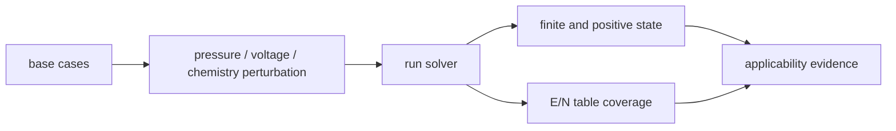
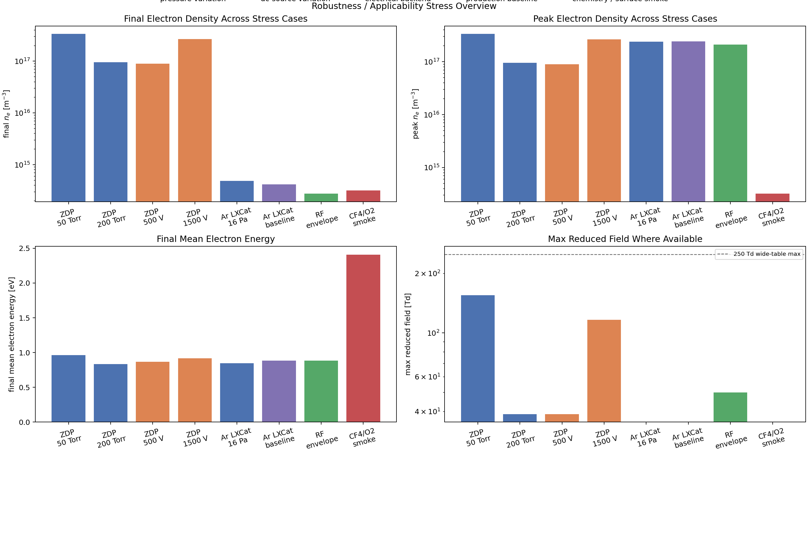

# ロバスト性ベンチマーク

このページは、条件を reference point から動かしたときに solver が破綻しないかを確認する robustness benchmark を説明します。ここでの benchmark は accuracy claim ではなく、numerical health と適用範囲の確認です。

## 結論

現在の stress cases は、positive finite electron density を保って最後まで実行できます。ZDPlaskin-derived stress cases では、observed E/N range も widened diagnostic table の範囲内に収まっています。

ただし、この結果は stress 条件に対する外部 solver との一致を意味しません。外部 reference があるのは主に base point であり、stress cases は「破綻していない」「table 外挿に落ちていない」ことを示す evidence として扱います。

## 何を動かしているか

| Family | 変更する条件 | この check で見ること |
|---|---|---|
| ZDPlaskin-derived Ar | pressure、voltage | DC Ar case の electrical backend と rate-table coverage |
| Pure-Ar LXCat ICP | baseline、pressure perturbation | Ar production baseline の condition sensitivity |
| RF envelope | RF drive closure | DC 以外の electrical backend が走るか |
| smoke chemistry | Ar/CF4/O2 chemistry | species 数と reaction family が増えた時の solver health |

stress check で見る量は、density、electron energy、reduced field、rate-table coverage です。実験値や外部 solver output との一致は、このページの判定対象ではありません。

## ワークフロー



reduced field は、用意した rate table の範囲内にあるかを確認します。

$$
E/N_{\min}^{\mathrm{table}}
\le
E/N_{\mathrm{observed}}(t)
\le
E/N_{\max}^{\mathrm{table}}
$$

この条件を満たすことは、rate coefficient を table 外へ外挿していないことを意味します。精度一致を意味するわけではありません。

## 結果図



この図では、stress case ごとの final electron density、peak electron density、final mean electron energy、max reduced field を見ます。棒の絶対値そのものよりも、全 case が有限・正で、条件変更に対して解釈可能な範囲に残っているかが重要です。


rate-table coverage 図では、灰色の帯が diagnostic table の active range、各線が simulation 中の observed E/N range を表します。observed range が帯の中にあれば、少なくともこの stress sweep では table 外挿に依存していません。

## 実行

```powershell
py tools\external_benchmarks\robustness_sweep.py
py tools\external_benchmarks\robustness_dashboard.py
```

主な出力:

- `examples/outputs/robustness_sweep/robustness_summary.csv`
- `examples/outputs/robustness_sweep/robustness_stress_overview.png`
- `examples/outputs/robustness_sweep/robustness_rate_table_coverage.png`
- `examples/outputs/robustness_sweep/robustness_applicability_report.md`

## 解釈上の限界

robustness sweep は、モデルが広い pressure / voltage / chemistry regime で正確であることを示しません。現状で言えるのは、選んだ stress cases で ODE integration が破綻せず、主要 diagnostics が有限・正で、ZDPlaskin-derived stress cases の E/N が diagnostic table 内に収まったということです。

次に精度主張を強めるには、stress 条件ごとの外部 solver output、BOLSIG+ / LXCat による independent rate-table comparison、または実験 data との比較が必要です。

## 参考リンク

| 対象 | 参考 |
|---|---|
| ZDPlasKin | [公式サイト](https://www.zdplaskin.laplace.univ-tlse.fr/) |
| CRANE | [CRANE documentation](https://crane-plasma-chemistry.readthedocs.io/en/latest/) |
| PyGMol | [PyPI: pygmol](https://pypi.org/project/pygmol/) |
| Ar cross-section data | [Zenodo DOI 10.5281/zenodo.8192503](https://doi.org/10.5281/zenodo.8192503) |
