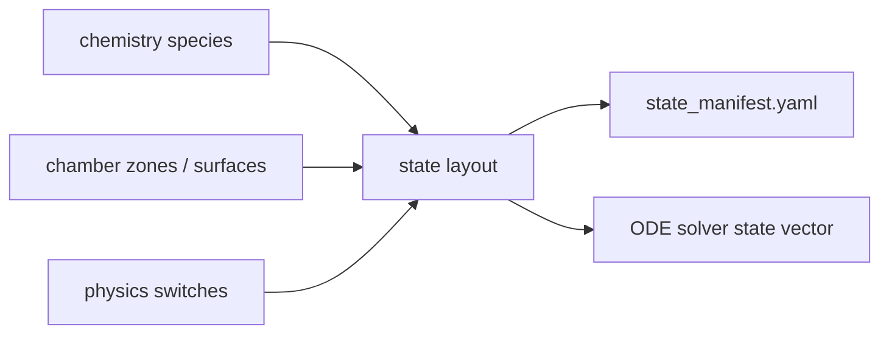

# state vector の読み方

このページでは、ODE solver が実際に解く state vector を `state_manifest.yaml` から読む方法を説明します。電子密度が state なのか、どの species が ODE で解かれているのかは、この file で確認します。

## state vector とは何か

ODE solver は、物理量を 1 本の vector として積分します。

$$
\mathbf{y}
= [y_0, y_1, \ldots, y_{N-1}]
$$

各 index が何を表すかは case によって変わるため、run ごとに `state_manifest.yaml` を出力して確認します。



## CRANE case の最小例

`examples/outputs/crane_two_reaction_argon/state_manifest.yaml` では、state は 3 個です。

```yaml
state_count: 3
zones:
- plasma
state_groups:
  gas_densities:
    start: 0
    stop: 2
    size: 2
  electron_energy:
    start: 2
    stop: 3
    size: 1
```

実際の state:

| Index | Label | Kind | Unit | 意味 |
|---:|---|---|---|---|
| 0 | `n[plasma,Ar]` | `gas_density` | `m^-3` | Ar gas density |
| 1 | `n[plasma,Ar_plus]` | `gas_density` | `m^-3` | Ar+ ion density |
| 2 | `We[plasma]` | `electron_energy_density` | `J m^-3` | electron energy density |

電子密度 `e` は state ではありません。

```yaml
electron_density:
  state_status: algebraic_not_state_variable
  closure: quasi_neutral
  formula: ne = max(sum(charge_i * n_i for gas-state species), floor_density)
```

この case では、quasi-neutrality により次のように決まります。

$$
n_e = \max(n_{\mathrm{Ar^+}}, n_{\min})
$$

## ZDPlaskin parity case の例

`examples/outputs/zdplaskin_example2_surrogate/state_manifest.yaml` では、state は 6 個です。

| Index | Label | Kind | Unit |
|---:|---|---|---|
| 0 | `n[plasma,Ar]` | gas density | `m^-3` |
| 1 | `n[plasma,Ar_star]` | gas density | `m^-3` |
| 2 | `n[plasma,Ar_plus]` | gas density | `m^-3` |
| 3 | `n[plasma,Ar2_plus]` | gas density | `m^-3` |
| 4 | `We[plasma]` | electron energy density | `J m^-3` |
| 5 | `film[wall]` | film thickness | `m` |

この case でも電子密度は state ではなく、荷電 gas species から代数的に再構成されます。

$$
n_e = \max(n_{\mathrm{Ar^+}} + n_{\mathrm{Ar_2^+}}, n_{\min})
$$

## `state_groups` の読み方

`state_groups` は、state vector の slice boundary です。

| Group | 意味 |
|---|---|
| `gas_densities` | gas species density の連続 block |
| `electron_energy` | zone ごとの electron energy density |
| `film_thickness` | surface film state |

例:

```yaml
gas_densities:
  start: 0
  stop: 4
  size: 4
```

Python slice と同じく、`start` は含み、`stop` は含みません。つまり `0, 1, 2, 3` が gas density block です。

## `species_catalog` の読み方

`species_catalog` は、chemistry に存在する species が state として解かれるか、代数的に決まるか、metadata だけかを示します。

| `state_status` | 意味 |
|---|---|
| `solved_gas_density` | ODE state として解く gas density |
| `algebraic_density_from_quasi_neutrality` | ODE state ではなく quasi-neutrality から計算 |
| `prescribed_external_profile` | 外部 profile から与える |
| `metadata_only` | reaction や surface metadata 用 |

## レビュー時に確認すること

| 確認 | 理由 |
|---|---|
| `state_count` が想定通りか | 不要な species や surface state が入っていないか |
| `electron_density.state_status` | 電子密度が ODE state か代数量か |
| `state_groups` の範囲 | downstream analysis の index 誤り防止 |
| `states[*].unit` | density と energy の単位確認 |
| `species_catalog[*].charge` | quasi-neutral electron density の再構成確認 |

## 関連ページ

- [モデルの入力と出力](MODEL_INPUT_OUTPUT.md)
- [出力の読み方](OUTPUT_READING_GUIDE.md)
- [物理モデルと近似](PHYSICS_MODELS_AND_APPROXIMATIONS.md)
