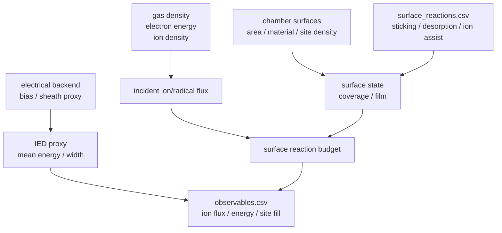

# 表面・ウェハ・IED ガイド

このページは、surface、wafer、ion flux、IED proxy の入力と出力を読むための入口です。化学入力の書き方は [化学入力仕様](CHEMISTRY_INPUT_SPEC.md)、出力列の意味は [observables.csv 列辞書](OBSERVABLES_COLUMN_REFERENCE.md) も参照してください。

## 何を扱うページか

global model では、空間分解 sheath や wafer 上の 2D 分布は解きません。代わりに、chamber の surface 定義、surface reaction、reduced sheath / IED proxy を組み合わせて、wafer や wall に届く flux と coverage の時系列を出します。



## 入力と出力の対応

| 入力 / 中間量 | どこで定義するか | 主な出力 |
|---|---|---|
| surface ID、area、temperature | chamber YAML `surfaces` | `ion_flux_<surface>_m2_s`, `site_fill_<surface>` |
| surface site density | chamber YAML `site_density_m2` | coverage、site warning |
| initial coverage | chamber YAML `initial_coverages` | 初期の `site_fill_*`, `free_site_fraction_*` |
| ion wall-loss model | chamber YAML `models.ion_loss` | `ion_loss_*`, electron density sink |
| surface reaction | `surface_reactions.csv` | `net_flux_*`, surface budget |
| sticking / desorption / ion assist model | `reaction_models.yaml` | coverage 変化、gas source/sink |
| bias / sheath proxy | chamber power port + recipe | `mean_ion_energy_*`, `ied_width_*`, `sheath_voltage_*` |

## chamber surface の読み方

Argon ICP baseline の wafer surface は次のように定義されています。

```yaml
surfaces:
  - surface_id: wafer
    zone_id: process
    kind: wafer
    area_m2: 0.0314
    material: Si
    temperature_K: 320.0
    site_density_m2: 5.0e18
    initial_coverages:
      wafer:*: 1.0
    models:
      ion_loss: bohm_edge_loss
```

| Key | 読み方 |
|---|---|
| `surface_id` | 出力列名や `surface_filter` で使う ID |
| `zone_id` | どの zone の gas species と接するか |
| `kind` | `wafer`, `wall` など、人が読むための分類 |
| `area_m2` | flux から total loss/source へ換算するときに効く |
| `temperature_K` | desorption や surface reaction の温度依存に効く |
| `site_density_m2` | coverage を絶対量へ換算する基準 |
| `initial_coverages` | surface species の初期占有状態 |
| `models.ion_loss` | ion wall-loss closure の種類 |

## surface species と coverage

surface species は `species.csv` で `phase=surface` として定義されます。

```csv
wafer:*,wafer:*,surface,0,0.0,site:1,wafer_site|wafer_*,site,,wafer
wafer:F*,wafer:F*,surface,0,18.9984,F:1;site:1,,adsorbate,,wafer
wafer:poly*,wafer:poly*,surface,0,50.0,C:1;F:2;site:1,,film_fragment,,wafer
```

| Surface species | 意味 |
|---|---|
| `wafer:*` | 空き site |
| `wafer:F*` | F が吸着した site |
| `wafer:poly*` | polymer fragment が占有した site |

coverage は概念的には次の制約で読みます。

$$
0 \le \theta_j \le 1,\qquad
\theta_{\mathrm{free}} + \sum_j \theta_j \approx 1
$$

`site_fill_wafer` が 1 に近いほど site が埋まり、`free_site_fraction_wafer` が 0 に近いほど新しい sticking が起きにくくなります。

## surface reaction の種類

surface reaction は `surface_reactions.csv` で定義します。

| Reaction | 物理的な読み方 | 出力で見るもの |
|---|---|---|
| `F + wafer:* -> wafer:F*` | radical adsorption | `site_fill_wafer`, `incident_flux_wafer_F_m2_s` |
| `CF3 + wafer:* -> wafer:poly* + F` | polymer precursor sticking | `film_wafer_m`, C/F flux ratio |
| `Ar_plus + wafer:F* -> Ar_plus + wafer:* + F` | ion-assisted desorption | `ion_flux_wafer_m2_s`, `mean_ion_energy_wafer_eV` |
| `wafer:F* -> wafer:* + F` | thermal desorption | surface temperature, `net_flux_wafer_F_m2_s` |
| `wafer:F* + wafer:F* -> wafer:* + wafer:* + F2` | Langmuir-Hinshelwood recombination | `net_flux_wafer_F2_m2_s` |

surface reaction は、gas reaction と違って「gas species の増減」と「surface coverage の増減」を同時に起こします。

## ion flux と radical flux の違い

| Flux | 代表列 | 主な意味 |
|---|---|---|
| ion flux | `ion_flux_wafer_m2_s` | sheath を通って wafer に届く charged particle flux |
| species-resolved ion flux | `ion_flux_wafer_Ar_plus_m2_s` | ion 種ごとの寄与 |
| radical incident flux | `radical_incident_flux_wafer_m2_s` | neutral radical が熱運動で surface に入射する flux |
| species incident flux | `incident_flux_wafer_F_m2_s` | gas species 別の incident flux |
| net surface flux | `net_flux_wafer_F_m2_s` | surface reaction 後の gas への正味の戻り/消費 |

radical flux と ion flux は同じ単位でも意味が違います。radical flux は surface chemistry の材料供給、ion flux は ion-assisted reaction や IED proxy と強く関係します。

## IED proxy の読み方

IED は ion energy distribution の略です。この repo の IED は、full ion-transit solver ではなく、global model の出力として使う reduced proxy です。

| 出力列 | 単位 | 読み方 |
|---|---|---|
| `mean_ion_energy_wafer_eV` | `eV` | wafer に届く ion energy の代表値 |
| `ied_width_wafer_eV` | `eV` | energy spread の proxy |
| `ied_collisionality_wafer` | dimensionless | sheath 内 collision の強さの目安 |
| `angle_spread_wafer_deg` | `deg` | angular spread の proxy |
| `sheath_voltage_wafer_V` | `V` | sheath voltage proxy |
| `sheath_thickness_wafer_m` | `m` | sheath thickness proxy |

```mermaid
flowchart LR
  Bias[wafer bias / plasma potential] --> Sheath[sheath proxy]
  Plasma[ion density / mean electron energy] --> Sheath
  Sheath --> Energy[mean ion energy]
  Sheath --> Width[IED width]
  Sheath --> Flux[ion flux]
  Energy --> IonAssist[ion-assisted surface reaction]
  Flux --> IonAssist
```



IED proxy は、trend や relative comparison を見るためのものです。実験 IED の peak shape、time-resolved sheath motion、ion transit physics を厳密に再現するものではありません。

## ion-loss model と wafer diagnostics の違い

混同しやすい点です。

| 項目 | 目的 | 主な出力 |
|---|---|---|
| ion wall loss | charged particle inventory の sink を与える | `ion_loss_family_*`, electron density |
| wafer ion flux | wafer/process interpretation 用の flux を出す | `ion_flux_wafer_m2_s` |
| IED proxy | ion energy / sheath-related proxy を出す | `mean_ion_energy_wafer_eV`, `ied_width_wafer_eV` |
| surface reaction | coverage と gas/surface source を更新する | `site_fill_*`, `net_flux_*`, budgets |

同じ surface が ion loss と wafer diagnostics の両方に関係することはありますが、目的は別です。electron density の妥当性を見るときは ion-loss model を、wafer process の傾向を見るときは flux / IED / coverage を見ます。

## 出力を読む順番

表面・ウェハ関連の出力は、次の順番で確認すると解釈しやすくなります。

| 順番 | 見るもの | 判断 |
|---:|---|---|
| 1 | `summary.yaml` の warning counts | site overfill / depletion がないか |
| 2 | `observables.csv` の `ion_flux_*`, `radical_*` | wafer に何が届いているか |
| 3 | `mean_ion_energy_*`, `sheath_voltage_*` | ion-assisted reaction を解釈できる energy か |
| 4 | `site_fill_*`, `free_site_fraction_*` | surface site が飽和していないか |
| 5 | `net_flux_*` | surface reaction 後の gas source/sink |
| 6 | `surface_reaction_budget.yaml` | どの surface reaction が支配的か |

## よくある異常と確認先

| 症状 | まず見る場所 |
|---|---|
| wafer flux が 0 のまま | chamber に `wafer` surface があるか、surface が正しい zone にあるか |
| surface reaction が効かない | `surface_filter`, surface species の `surfaces`, `enabled` |
| `site_fill` が 1 を超える | coverage factor、initial coverage、site density |
| `free_site_fraction` が 0 に張り付く | sticking が強すぎる、desorption / ion assist が弱い |
| ion-assisted reaction が効かない | `ion_flux_*`, `mean_ion_energy_*`, threshold energy |
| IED が期待と違う | bias port、plasma potential、electrical backend の限界 |

## このページで保証しないこと

| 項目 | 理由 |
|---|---|
| 実 wafer 上の 2D 分布 | global model は空間平均モデル |
| time-resolved IED shape | IED は reduced proxy |
| material-specific etch yield の精度 | chemistry と yield calibration に依存 |
| sheath の詳細構造 | sheath solver ではない |
