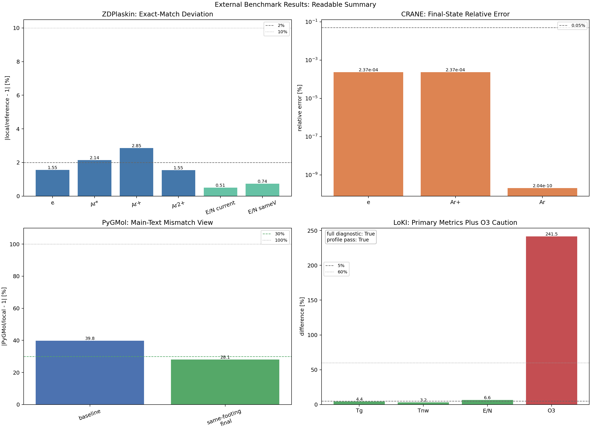
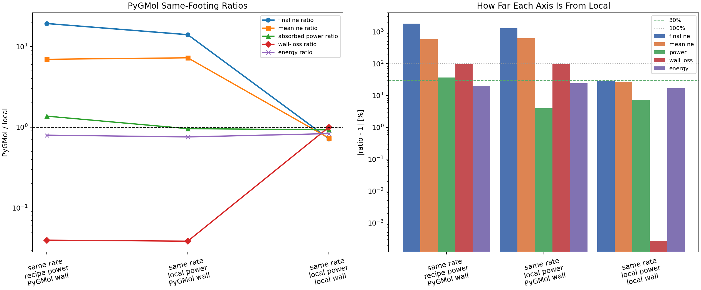

# External Benchmark Report

Generated at UTC `2026-04-25T11:23:48.098173+00:00`.

## 1. Purpose and local-model scope

The local code is a reactor-averaged low-pressure plasma model that solves species balance, electron-energy closure, wall-loss closure, and optional electrical backends from YAML-defined chemistry and chamber inputs. The external benchmark suite is intentionally kept outside the core package so reference-code adapters do not change production solver logic.

Within the present benchmark set, the strongest direct support is limited to the current DC Ar parity case, a scalar-chemistry regression, and a digitized O2 trend/profile benchmark. Broader pressure, power, and chemistry excursions are treated separately as applicability evidence rather than strict validation.

This report is written in a paper-style structure: first the benchmark footing, then what each benchmark actually compares, then the quantitative results, and finally the physical interpretation and remaining limitations.

## 2. Benchmark set and comparison targets

| Benchmark | Reference type | Comparison target | Same-footing level | Main limitation |
| --- | --- | --- | --- | --- |
| ZDPlaskin example2 | strict executable parity | DC series-discharge state with committed ZDPlaskin output | high | single published Ar case; no spatial profiles |
| CRANE TwoReactionArgon | strict scalar-chemistry parity | public two-reaction argon tutorial output | high | not a full plasma-discharge closure benchmark |
| PyGMol Ar baseline | broad executable global-model comparison | compact executable Ar global model with independent closure choices | medium | electron-impact rates and wall closure are not naturally aligned |
| PyGMol same-footing | diagnostic decomposition benchmark | same-rate, same-power, and same-wall-loss staged alignment | medium-high | still a different executable model, not strict parity chemistry |
| LoKI O2 DC glow | digitized-reference benchmark | published O2 DC glow pressure sweep and radial-profile figures | medium | digitized figures, not official raw-output files |

### Coverage map

Interpretation of the coverage matrix: `S` means the quantity is compared directly, `D` means it is only covered diagnostically or indirectly, and `0` means the benchmark does not directly constrain that axis.

## 3. Headline quantitative results

| Benchmark | Reference type | Headline metric | Value [%] | Interpretation |
| --- | --- | --- | --- | --- |
| ZDPlaskin example2 | strict executable parity | max exact-match deviation over species and E/N | 2.85 | strong same-footing agreement for the current DC Ar parity case |
| CRANE TwoReactionArgon | strict scalar-chemistry parity | max final-state relative error | 0.000237 | reaction assembly, units, and stiff ODE integration are effectively exact |
| PyGMol Ar baseline | broad executable global-model comparison | production-step electron-density mismatch | 39.8 | reasonable order agreement, but still a meaningful model-closure gap |
| PyGMol same-footing final stage | diagnostic decomposition benchmark | production-step electron-density mismatch | 28.1 | most of the PyGMol gap is explained by power and wall-loss closure differences |
| LoKI O2 DC glow | digitized-reference benchmark | max primary-discharge difference over Tg/Tnw/E/N | 6.56 | primary discharge quantities are close, but species complexity must be read separately |

### Integrated overview

The overview figure is intended for the main Results section. It keeps one compact panel per benchmark family and expresses agreement in percent space instead of raw ratios so a reader can see at a glance whether the comparison is near-exact, broadly consistent, or still structurally different. Deliberately diagnostic rows such as PyGMol same-rate-only and secondary LoKI chemistry subsets are left out of this main-text summary and discussed later instead.

### PyGMol decomposition

The PyGMol figure is intended for Discussion. The left panel shows raw `PyGMol/local` ratios. The right panel converts the same information into mismatch percentages so the dominant closure difference can be read without mentally translating values like `0.72` or `19.2`.

## 4. Benchmark-by-benchmark interpretation

### 4.1 ZDPlaskin example2

This is the strictest same-footing discharge benchmark in the current set. The current local run stays within about `2.85%` for the reported final species set, while the same-footing E/N comparison remains near sub-percent to percent-level agreement. In a paper, this should be presented as evidence that the current DC-series Ar parity case is self-consistent on the chosen physical footing.

### 4.2 CRANE TwoReactionArgon

CRANE is not a full plasma-discharge benchmark, but it is the cleanest scalar chemistry check. The maximum final-state relative error is `2.366e-04%`, so this benchmark is best cited as validation of reaction assembly, SI conversion, and stiff ODE integration.

### 4.3 PyGMol executable comparison

PyGMol should be described as an executable global-model comparison, not as a strict parity reference. The baseline production-step electron-density mismatch is `39.8%`. Using the same local electron-impact table alone does not close the gap and leaves a mismatch of `1823.0%`. After same-rate, same-power, and same-wall-loss alignment, the final-stage production mismatch falls to `28.1%`. That pattern strongly supports the interpretation that power deposition and wall-loss closure dominate the PyGMol difference more than the electron-impact table itself.

### 4.4 LoKI O2 DC glow

The LoKI benchmark now runs through the full diagnostic stage and passes the profile-shape checks (`profile pass = True`). The maximum primary-discharge difference over `Tg`, `Tnw`, and `E/N` is `6.6%`, while `O3` remains the clearest outlier at `241.5%`. For manuscript use, this should be framed as a successful primary-discharge and profile benchmark with a chemically demanding ozone channel that still exposes transport/chemistry limitations.

## 5. Recommended manuscript logic

A reader-friendly order is:

1. State what the local model solves and what it does not solve.
2. Separate strict parity references from executable sanity checks and digitized references.
3. Use ZDPlaskin and CRANE to establish numerical trustworthiness.
4. Use PyGMol to show which model-closure choices change the discharge state.
5. Use LoKI to show whether low-pressure O2 pressure trends and profile shapes are physically credible.
6. Add the robustness/applicability suite as a distinct support layer for operating-envelope claims.
7. End by stating clearly which physics are validated, which are only diagnostically supported, and which remain open.

## 6. Benchmark limitations

| Benchmark | Main limitation | Why it matters |
| --- | --- | --- |
| ZDPlaskin example2 | single committed Ar discharge case | strong for same-footing DC parity, weak for generality across chemistry and operating space |
| CRANE TwoReactionArgon | scalar chemistry only | does not validate circuit closure, wall loss, transport closure, or electron-energy physics |
| PyGMol Ar baseline / same-footing | independent executable model with different native closure choices | useful for sensitivity decomposition, but not a strict accuracy proof for the local solver |
| LoKI O2 DC glow | digitized publication figures rather than official raw-output files | good for pressure trends and profile-shape credibility, but not raw-output parity |

The role of this table is to prevent overclaiming. Each benchmark is useful, but each one constrains only part of the full low-pressure plasma-model problem.

## 7. Supported versus not yet validated

### 7.1 Main-text concluding table

| Topic | Support level | Supporting benchmark |
| --- | --- | --- |
| Reaction assembly, SI conversion, and stiff ODE integration | validated within current benchmark scope | CRANE TwoReactionArgon |
| Current DC Ar same-footing species and physical E/N parity | validated within current benchmark scope | ZDPlaskin example2 |
| Low-pressure O2 primary-discharge pressure trends and profile shapes | supported by digitized benchmark | LoKI O2 DC glow digitized benchmark |
| Cross-code global-model agreement without closure harmonization | not yet validated | PyGMol executable comparison |
| Quantitative ozone-heavy O2 chemistry | not yet validated | LoKI O2 DC glow O3 comparison |
| Generality across pressures, power waveforms, and unrelated chemistries | not yet validated | current external set |

This short table is the version to keep in the main text. It preserves the distinction between direct validation, digitized-reference support, and not-yet-validated claims without pulling too much detail into the conclusion.

### 7.2 Supplementary detailed concluding table

| Topic | Support level | Evidence | Comment |
| --- | --- | --- | --- |
| Reaction assembly, SI conversion, and stiff ODE integration | validated within current benchmark scope | CRANE TwoReactionArgon | final-state relative error remains at about 2.4e-4 % or smaller |
| Current DC Ar same-footing species and physical E/N parity | validated within current benchmark scope | ZDPlaskin example2 | headline exact-match deviation remains below about 3 % for the current parity case |
| Low-pressure O2 primary-discharge pressure trends and profile shapes | supported by digitized benchmark | LoKI O2 DC glow digitized benchmark | primary Tg/Tnw/E/N difference stays near 6.6 % and profile-shape checks pass |
| Cross-code global-model agreement without closure harmonization | not yet validated | PyGMol executable comparison | PyGMol remains sensitive to power and wall-loss closure, so baseline cross-code agreement is not a proof of correctness |
| Quantitative ozone-heavy O2 chemistry | not yet validated | LoKI O2 DC glow O3 comparison | O3 remains an outlier at about 241.5 % |
| Generality across pressures, power waveforms, and unrelated chemistries | not yet validated | current external set | the present benchmark set is informative but still too narrow to claim broad process-space validation |

This detailed table is the supplement-facing version. It retains the evidence path and the cautionary comment needed to defend each claim during review.

## 8. Applicability evidence from the robustness suite

The strict-validation table above should be read together with a separate robustness/applicability suite. That suite does not introduce new authoritative external references. Instead, it asks a narrower but still important question: does the code remain physically bounded and practically usable when pressure, source voltage, electrical backend, and chemistry are perturbed away from the parity points?

| Item | Value | Why it helps |
| --- | --- | --- |
| Strict external references retained | 2 | the strict validation backbone is unchanged |
| Added stress / applicability cases | 8 | pressure, source-voltage, electrical-backend, and chemistry perturbations |
| Stress cases passing boundedness checks | 8/8 | finite positive solver-health checks across the executed perturbations |
| Interpretation | boundedness / applicability evidence | supports practical usability and operating-envelope claims, not new strict accuracy validation or predictive-accuracy proof |

The intended reading is narrow: these results support boundedness, workflow usability, and operating-envelope plausibility only. They do not by themselves validate predicted densities, powers, or radical levels against external truth.

The accompanying robustness artifacts are kept separate on purpose:

- [robustness stress overview](../robustness_sweep/robustness_stress_overview.png)
- [robustness rate-table coverage](../robustness_sweep/robustness_rate_table_coverage.png)
- [robustness applicability report](../robustness_sweep/robustness_applicability_report.md)

This one-level cross-reference lets a manuscript place strict validation and practical applicability side by side without implying that stress-case boundedness is the same thing as external or experimental validation.

## 9. Additional calculations and figures worth keeping

- Keep percent-space mismatch metrics for all headline comparisons. They are much easier to read in a paper than raw ratios.
- Keep one benchmark-coverage figure. It prevents readers from mistaking CRANE or PyGMol for the wrong kind of validation.
- Keep the PyGMol staged-decomposition figure. It is the clearest demonstration of why executable global models can disagree.
- When discussing LoKI, separate primary discharge quantities from difficult chemistry channels such as `O3`.
- Keep a one-level pointer from the main benchmark report to the robustness suite so generality claims remain visibly weaker than strict validation claims, but not invisible.
- If a later paper needs a shorter main text, move the detailed metric CSV and YAML outputs to supplementary material and keep only the coverage matrix plus the two current result figures in the main body.
