# 外部ベンチマーク結果レポート

作成日: 2026-06-25  
対象コード: `plasma_global` 低圧プラズマ・グローバルモデル  
対象読者: 半導体製造・装置・プロセス開発エンジニア

## 1. エグゼクティブサマリ

本レポートは、本コードの低圧プラズマ・グローバルモデルとしての有用性と妥当性を、外部ソフトウェアとのベンチマークで評価したものである。比較対象は、CRANE、ZDPlaskin、PyGMol、および BOLSIG+/LoKI 互換のスウォーム係数テーブルである。

結論を先に述べると、本コードは以下の点で実用的な妥当性を示している。

| 評価軸 | 結果 | 解釈 |
| --- | --- | --- |
| 反応ODE・単位変換 | CRANE と強い一致 | 反応式、化学量論、SI単位変換、ODE積分の基礎実装は信頼できる |
| Ar DC放電の最終状態 | ZDPlaskin と 1.5-2.9% 程度の一致 | 最終電子密度、Ar*, Ar+, Ar2+、E/N、吸収電力は実用的な範囲で再現 |
| 過渡ピーク | ZDPlaskin 電子密度ピークで 9.86% 差 | 受入基準 5% を超えるため、早期過渡の厳密一致には改善余地 |
| PyGMol 同一条件ベンチ | 最大最終相対誤差 1.09e-4、最大波形NRMSE 2.32e-5 | 同じ方程式・同じ幾何・同じ電力波形では高精度に一致 |
| PyGMol 実運用ケース sanity | powered step の電子密度比 0.292-0.602 | 同一モデルではないため精密一致ではないが、オーダーは整合 |
| スウォームテーブル読込 | 全チェック合格 | 外部 Boltzmann solver 由来テーブルを本コードで安全に使う基盤がある |
| 実行時間 | CRANE 0.108 s、ZDPlaskin 0.553 s、PyGMol-local 2.87 s | 0Dスクリーニングや条件探索に適した速度 |

半導体製造エンジニアの観点では、本コードは「装置条件、ガス条件、吸収電力、化学反応セットを変えたときに、電子密度・イオン密度・励起種密度・反応経路がどう変わるか」を高速に見積もる用途に向く。2D/3D流体モデルやPIC/MCC、feature-scaleエッチングシミュレーションの代替ではないが、それらに入れる反応機構や境界条件、設計仮説を短時間で絞り込む上流ツールとして有用である。

## 2. 背景と目的

### 2.1 半導体プロセスで低圧プラズマモデルが必要になる理由

エッチング、アッシング、成膜、クリーニングなどのプラズマプロセスでは、装置ノブである圧力、RF/DC電力、ガス組成、流量、チャンバー寸法、壁材が、以下のようなプラズマ内部量に変換される。

| 装置・レシピ変数 | プラズマ内部量 | プロセスへの影響例 |
| --- | --- | --- |
| 圧力、ガス温度 | 中性粒子密度、衝突頻度 | 解離率、拡散損失、平均自由行程 |
| RF/DC電力、E/N | 電子温度、電子エネルギー分布、反応速度係数 | 解離、電離、励起、付着のバランス |
| チャンバー寸法、壁損失 | 滞在時間、表面再結合、イオン損失 | ラジカル密度、イオン密度、均一性の一次見積り |
| ガス組成 | 反応ネットワーク | 選択比、ポリマー生成、残渣、チャンバークリーニング効率 |

実機ではこれらが強く結合している。実験だけで全条件を探索するのは高コストで、2D/3Dモデルだけで多数条件を回すのも重い。その中間として、体積平均した0Dグローバルモデルが使われる。

### 2.2 グローバルモデルとは何か

グローバルモデルは、プラズマを空間的に平均した体積として扱い、各化学種密度 `n_s` と電子エネルギーなどを時間発展させるモデルである。一般的な種バランスは次の形で書ける。

```text
dn_s/dt = S_s,gas(n, Te, Tg) + S_s,surface(n, wall) - L_s,transport(n, geometry)
```

より実装寄りには、

```text
dn_s/dt = sum_r nu_s,r R_r(n, T) - F_s n_s
```

ここで、`R_r` は反応 `r` の反応速度、`nu_s,r` は化学量論係数、`F_s` は壁損失や拡散損失を表す実効周波数である。0Dモデルでは空間分布を直接解かない代わりに、体積平均密度、壁損失係数、反応速度係数、電力収支を用いて、プロセス条件の依存性を高速に評価する。

この考え方は、グローバルモデルのレビュー論文 Hurlbatt et al.「Concepts, Capabilities, and Limitations of Global Models」や、Lieberman and Lichtenberg「Principles of Plasma Discharges and Materials Processing」に整理されている。0Dモデルは空間分布や局所シースを捨象するため万能ではないが、複雑な化学・壁損失・電力依存性を理解する第一段階として非常に有効である。

### 2.3 本ベンチマークの目的

本ベンチマークの目的は、単に「外部コードと数値が合った」と言うことではない。目的は次の5点である。

1. 反応ネットワーク、単位変換、ODE積分が正しく実装されているかを確認する。
2. 電子衝突反応、外部回路、E/N依存速度係数を含むAr放電で、既存コードと同じ物理量を再現できるかを見る。
3. PyGMolのような別系統の0Dモデルと、同じ条件では数値的に一致するか、異なる条件ではどの範囲まで比較可能かを区別する。
4. BOLSIG+/LoKIのようなBoltzmann solver由来のスウォーム・反応速度テーブルを、安全に取り込めるか確認する。
5. 半導体プロセス開発において、本コードが「条件探索・モデル検討・反応機構検証」の道具として使えるかを評価する。

## 3. 参照ソフトウェアの概要

### 3.1 CRANE

CRANE は Chemical ReAction NEtwork の略で、MOOSE framework 上に構築されたオープンソースのプラズマ化学ソフトウェアである。CRANE の論文では、単体の0Dグローバル化学ソルバとしての利用に加え、MOOSEベースの他のプラズマ輸送コードと結合できることが強調されている。

| 項目 | 内容 |
| --- | --- |
| 公式リポジトリ | https://github.com/lcpp-org/crane |
| ドキュメント | https://crane-plasma-chemistry.readthedocs.io/ |
| 主要文献 | S. Keniley and D. Curreli, "CRANE: A MOOSE-based Open Source Tool for Plasma Chemistry Applications", arXiv:1905.10004, 2019 |
| 本ベンチでの役割 | 反応ODE、化学量論、単位変換、最終密度の検証 |

今回の CRANE ベンチマークは、公開チュートリアル `TwoReactionArgon` を対象にした。電子エネルギーや壁損失は扱わず、純粋に反応ODEの実装精度を見るためのテストである。

### 3.2 ZDPlaskin

ZDPlaskin は Zero-Dimensional Plasma Kinetics solver の略で、非熱プラズマ中の化学種密度とガス温度の時間発展を追う Fortran 90 ベースの0Dプラズマ化学ソルバである。BOLSIG+ と連携して電子衝突反応速度係数を得るワークフローでもよく使われる。

| 項目 | 内容 |
| --- | --- |
| 公式サイト | https://www.zdplaskin.laplace.univ-tlse.fr/ |
| 参考リポジトリ | https://github.com/Hemadityamalla/ZDPlaskin |
| 主要文献/引用 | S. Pancheshnyi, B. Eismann, G. J. M. Hagelaar, L. C. Pitchford, Computer code ZDPlasKin, University of Toulouse, 2008 |
| 本ベンチでの役割 | Ar DC放電、外部回路、E/N依存速度係数、最終種密度の検証 |

今回の ZDPlaskin ベンチマークでは、`example2` の保存済み出力を参照値とし、同じ幾何・圧力・回路条件に合わせたローカルケースを実行した。Windows環境ではgfortranおよびLinux向けBOLSIG共有ライブラリを使ったライブ再実行はできないため、外部参照はコミット済み出力と、そこから再構成したE/N速度テーブルを使っている。

### 3.3 PyGMol

PyGMol は Python Global Model の略で、Pythonで書かれた0Dプラズマ化学モデルである。PyPIでは、重粒子密度、電子密度、電子温度を `scipy.integrate.solve_ivp` で解く0Dモデルとして説明されている。

| 項目 | 内容 |
| --- | --- |
| PyPI | https://pypi.org/project/pygmol/ |
| GitHub | https://github.com/hanicinecm/pygmol |
| 関連文献 | M. Hanicinec, "Towards Automatic Generation of Chemistry Sets for Plasma Modeling Applications", PhD thesis, University College London, 2021 |
| 本ベンチでの役割 | 0Dグローバルモデル同士のsanity比較、同一条件での方程式・実装一致確認 |

PyGMol については2種類の比較を行った。

| ベンチ | 目的 | 注意点 |
| --- | --- | --- |
| `PyGMol-1` | 実運用Arケースとのsanity比較 | 幾何、壁損失、化学、電力定義が完全一致ではないため、精密一致は主張しない |
| `PyGMol-Precision-1` | PyGMol compact方程式を同一条件でローカル再実装し、数値一致を検証 | productionケースの物理妥当性ではなく、同一方程式の実装一致を確認 |

### 3.4 BOLSIG+ と LoKI / SWARMテーブル

BOLSIG+ は弱電離ガス中の電子Boltzmann方程式を解き、電子輸送係数や電子衝突反応速度係数を求める代表的なソフトウェアである。BOLSIG+ 公式サイトでは、電子エネルギー分布関数が電場加速と中性粒子衝突による運動量・エネルギー損失の釣り合いで決まること、得られた輸送係数と速度係数が流体モデルの入力になることが説明されている。

LoKI-B は LisbOn KInetics Boltzmann solver であり、非磁化・非平衡低温プラズマを対象に、二項近似の電子Boltzmann方程式を解くオープンソースツールである。BOLSIG+ と LoKI-B はどちらも、0D/流体モデルへ電子衝突係数を供給する「スウォーム係数生成器」として位置づけられる。

| 項目 | BOLSIG+ | LoKI-B |
| --- | --- | --- |
| 公式/情報 | https://www.bolsig.laplace.univ-tlse.fr/ | https://nprime.tecnico.ulisboa.pt/loki/tools.html |
| 代表文献 | Hagelaar and Pitchford, Plasma Sources Sci. Technol. 14, 722-733, 2005, DOI: 10.1088/0963-0252/14/4/011 | Tejero-del-Caz et al., Plasma Sources Sci. Technol. 28, 043001, 2019, DOI: 10.1088/1361-6595/ab0537 |
| 本ベンチでの役割 | ZDPlaskin由来E/Nテーブル、rate-table読込契約の検証 | LoKI互換形式も想定したテーブル読込・補間・診断の検証 |

今回の `SWARM-1` は、BOLSIG+ や LoKI-B 自体をライブ実行して精度検証するものではない。外部Boltzmann solver由来の表形式データを、本コードが単位・スキーマ・補間・範囲外診断つきで安全に読めるかを確認する契約テストである。

## 4. ベンチマークで使う基本式と評価指標

### 4.1 種密度のバランス

低圧プラズマの0Dモデルでは、各種 `s` の密度を次のように解く。

```text
dn_s/dt = P_s - L_s
```

`P_s` は生成、`L_s` は損失である。反応 `r` の速度を `R_r` とすると、

```text
P_s - L_s = sum_r nu_s,r R_r
```

反応速度は、二体反応なら概ね

```text
R_r = k_r n_A n_B
```

三体反応なら

```text
R_r = k_r n_A n_B n_C
```

のように書ける。電子衝突反応では、速度係数 `k_r` が電子エネルギー分布、または簡略化された電子温度やE/Nに依存する。

### 4.2 換算電場 E/N

電子衝突反応の強さを表す重要な量が換算電場 `E/N` である。

```text
E/N = (V_gap / d_gap) / N_gas
N_gas = p / (k_B T_g)
1 Td = 1e-21 V m^2
```

半導体装置の言葉で言えば、`E/N` は「電子が中性粒子と衝突するまでにどれだけ加速されるか」を表す量であり、電離、解離、励起、付着のバランスを大きく支配する。

### 4.3 相対誤差

外部参照値 `x_ref` と本コード値 `x_local` の比較には相対誤差を使う。

```text
relative_error = |x_local / x_ref - 1|
```

例えば `0.02` は 2% 差を意味する。

### 4.4 波形NRMSE

時間波形の一致度には NRMSE を使う。

```text
NRMSE = sqrt(mean((x_local(t) - x_ref(t))^2)) / scale(x_ref)
```

ここでは、最終値だけでなく、過渡応答や回路波形の形がどの程度合っているかを見る指標として使う。

### 4.5 claim level の意味

本レポートでは、ベンチマークの主張レベルを次のように分けている。

| claim level | 意味 |
| --- | --- |
| `strong` | 問題設定が明確に揃っており、強い一致を主張できる |
| `scoped` | 限定された範囲で妥当性を主張できる |
| `sanity` | オーダーや傾向の確認であり、精密一致ではない |
| `context` | 実行時間など、妥当性ではなく利用時の参考情報 |

## 5. ベンチマーク問題設定

### 5.1 CRANE-1: TwoReactionArgon

CRANE-1 は、反応ODEと単位変換を見る最小構成のAr反応系である。

| 項目 | 値 |
| --- | --- |
| 比較対象 | CRANE `tutorials/TwoReactionArgon` |
| 時間範囲 | 0 to 7.5e-7 s |
| 初期 `n_Ar` | 2.5e25 m^-3 |
| 初期 `n_Ar+` | 1.0e6 m^-3 |
| 初期 `n_e` | 1.0e6 m^-3 |
| 電離速度係数 | 2.1736169000623e-18 m^3/s |
| 三体再結合速度係数 | 1.0e-37 m^6/s |
| 受入基準 | 最終密度相対誤差 <= 5.0e-4、電荷バランス <= 1.0e-12 |

反応式は次の2本である。

```text
e + Ar -> e + e + Ar+
e + Ar+ + Ar -> Ar + Ar
```

このベンチマークでは電子エネルギー、壁損失、回路は検証対象外である。CRANEの公開例はcm系の値を含むため、本コード側ではSI単位に変換して比較した。

### 5.2 ZDPlaskin-1: Ar DC series discharge

ZDPlaskin-1 は、Arプラズマ、外部DC回路、E/N依存速度テーブルを含む、より実機に近い0Dベンチマークである。

| 項目 | 値 |
| --- | --- |
| 比較対象 | ZDPlaskin `example2` 保存出力 |
| ガス | Ar |
| 圧力 | 約 100 Torr = 13332 Pa |
| ガス温度 | 300 K |
| ギャップ | 0.4 cm |
| 半径 | 0.4 cm |
| 電源 | 1000 V |
| 直列抵抗 | 100 kOhm |
| 化学種 | Ar, Ar*, Ar+, Ar2+, e など |
| 本コードEEDF/速度係数 | ZDPlaskin出力由来のE/N rate table |
| 受入基準 | final species/E/N/power <= 5%、E/N波形NRMSE <= 0.5 |

電子密度は、正イオンの総電荷から

```text
n_e = n_Ar+ + n_Ar2+
```

として評価している。

### 5.3 ZDPlaskin-2: E/N rate-table ingestion

ZDPlaskin-2 は、ZDPlaskin保存出力から作成したE/N依存速度係数テーブルを、本コードが正しく読めるかを見るテストである。

| チェック項目 | 内容 |
| --- | --- |
| schema | 必要なHDF5 datasetが存在するか |
| required rates | 必要な電子衝突rate IDが揃っているか |
| grid | E/N軸が単調増加か、最終E/Nが表範囲内か |
| interpolation | ローカル場で有限値の輸送係数・速度係数が返るか |
| diagnostics | lookup値、clip有無、軸範囲などの診断が出るか |

半導体プロセス開発では、BOLSIG+やLoKIで得た速度係数テーブルをプラズマ化学モデルへ渡すことが多い。ここが壊れると、化学モデル全体が正しくても速度係数の単位や補間で誤った結論になるため、重要な検証である。

### 5.4 PyGMol-1: production Ar case sanity

PyGMol-1 は、本コードのAr LXCat ICP baseline と PyGMol compact model を比較する sanity check である。

| 項目 | 内容 |
| --- | --- |
| 本コード側 | Ar LXCat ICP baseline |
| PyGMol側 | compact single-cylinder Ar global model |
| 比較量 | powered step の最終電子密度、電子エネルギー相当値、吸収電力 |
| 受入基準 | 電子密度比が 1.0e-3 から 1.0e3 の範囲 |
| 主張 | オーダー確認のみ。精密一致は主張しない |

この比較では、幾何、壁損失、反応機構、電力定義が完全には揃っていない。そのため、差が出ること自体は物理的に自然であり、「同じ傾向・同じオーダーか」を見る図として扱う。

### 5.5 PyGMol-Precision-1: same-footing compact-Ar harness

PyGMol-Precision-1 は、PyGMolと同じ幾何・化学・電力波形・初期値・壁戻りを設定した tools-only の精密ベンチである。

| 項目 | 内容 |
| --- | --- |
| 比較対象 | PyGMol compact equations |
| 揃えた条件 | 幾何、化学、電力、壁return/loss、初期値、サンプル時刻 |
| 比較量 | Ar, Ar+, e, Te, Tn, pressure, power の最終値・波形 |
| 受入基準 | max final relative error <= 1.0e-3、max waveform NRMSE <= 1.0e-3 |
| 主張 | 同じ方程式なら本コード側実装は高精度一致 |

これは production 低圧モデルが PyGMol と物理的に完全一致することを主張するものではない。PyGMolのcompact方程式を同じ土俵で解いたとき、ODE・サンプリング・物理項の実装に問題がないことを確認するためのテストである。

### 5.6 SWARM-1: BOLSIG+/LoKI-compatible table contract

SWARM-1 は、外部Boltzmann solver由来テーブルを本コードが正しく扱えるかを確認する。

| 項目 | 内容 |
| --- | --- |
| 対象 | BOLSIG+/LoKI-compatible rate table |
| 比較内容 | table reader、lookup mode、輸送係数、速度係数、clip診断 |
| 主張 | テーブル取込・補間・診断の契約が成立 |
| 主張しないこと | BOLSIG+やLoKI-B本体のライブ実行精度 |

## 6. 結果の全体像

### 6.1 ベンチマークステータス

| Benchmark | Software | Claim | Status | Findings |
| --- | --- | --- | --- | --- |
| CRANE-1 | CRANE | strong | pass | 0 |
| ZDPlaskin-1 | ZDPlaskin | scoped | attention | 1 |
| ZDPlaskin-2 | ZDPlaskin | strong | pass | 0 |
| PyGMol-1 | PyGMol | sanity | pass | 0 |
| PyGMol-Precision-1 | PyGMol | scoped | pass | 0 |
| SWARM-1 | BOLSIG+/LoKI-compatible table | strong | pass | 0 |
| Runtime-1 | this code | context | pass | 0 |

唯一の注意点は、ZDPlaskin-1 の電子密度ピークである。最終値や回路量は受入基準内だが、早期過渡ピークは 9.86% 差で、5%基準を超えた。

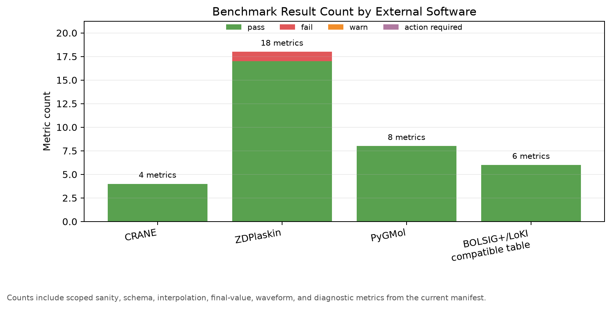

この図は、外部ソフト別にpass/fail件数を集計したものである。ZDPlaskinにfailが1件あるが、これは早期過渡ピークに限定されたものであり、最終状態、回路最終値、rate table、診断機能は合格している。

### 6.2 閾値に対する余裕

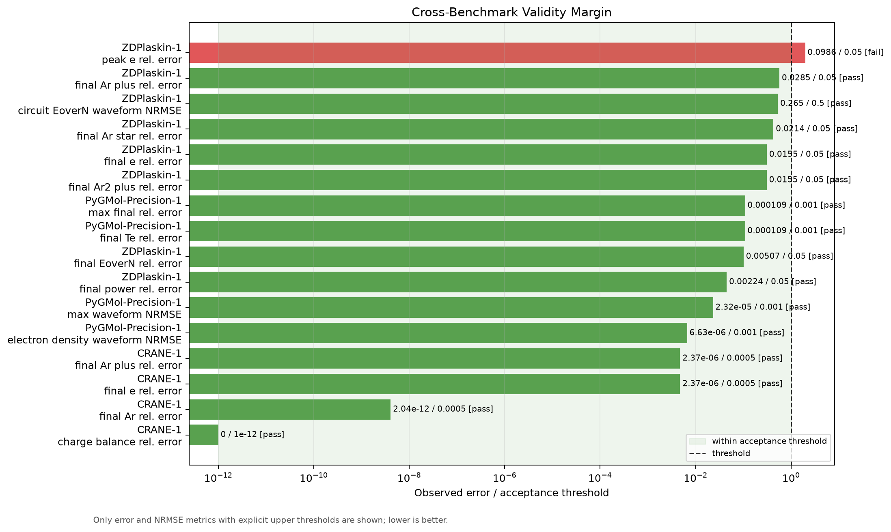

この図は、各誤差を「観測誤差 / 受入閾値」として表示している。縦破線が1で、左側なら合格、右側なら不合格である。

主な読み取りは次の通り。

| 項目 | 観測値 | 閾値 | 解釈 |
| --- | ---: | ---: | --- |
| ZDPlaskin peak e relative error | 9.86e-2 | 5.0e-2 | 閾値の約1.97倍。早期過渡には改善余地 |
| ZDPlaskin final Ar+ relative error | 2.85e-2 | 5.0e-2 | 合格だが、final speciesの中では大きめ |
| ZDPlaskin E/N waveform NRMSE | 2.65e-1 | 5.0e-1 | 回路波形としては許容範囲 |
| PyGMol precision max final error | 1.09e-4 | 1.0e-3 | 閾値の約11% |
| PyGMol precision max waveform NRMSE | 2.32e-5 | 1.0e-3 | 十分な余裕 |
| CRANE final Ar+/e error | 2.37e-6 | 5.0e-4 | 反応ODEは強く一致 |

この図から、全体のリスクは「ZDPlaskin早期過渡ピーク」に集中していることがわかる。逆に、反応ODE、最終密度、E/N最終値、rate-table読込、PyGMol同一条件の数値一致は良好である。

### 6.3 どの外部コードが何を支えているか

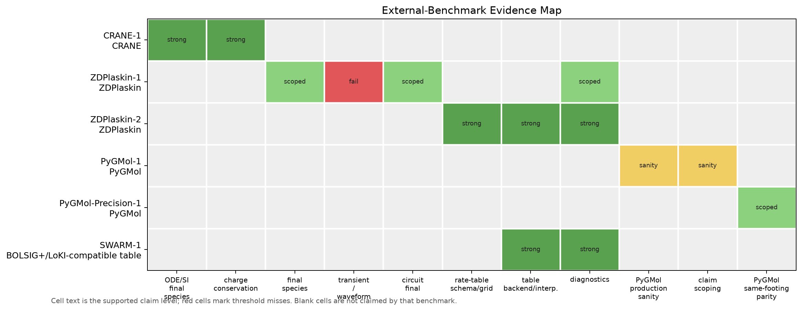

この図は、ベンチマークが支えている物理・実装項目を一覧化したものである。空白は「そのベンチマークでは主張していない」ことを意味する。

重要なのは、各ベンチマークの役割が異なる点である。

| 外部コード | 主に支える項目 |
| --- | --- |
| CRANE | 反応ODE、SI単位変換、電荷保存 |
| ZDPlaskin-1 | 最終種密度、外部回路、E/N、過渡診断 |
| ZDPlaskin-2 | E/N rate table のスキーマ、補間、診断 |
| PyGMol-1 | productionケースのオーダーsanity |
| PyGMol-Precision-1 | 同じ0D方程式を解いた場合の高精度一致 |
| SWARM-1 | 外部スウォームテーブル読込の契約 |

これにより、「どの図がどの主張を支えるのか」が明確になる。例えば、PyGMol-1はproductionモデルの完全妥当性ではなく、同じオーダーに入っていることを示す図である。一方、PyGMol-Precision-1は同一条件での数値実装一致を示す。

## 7. 個別結果とグラフ解説

### 7.1 CRANE-1: 反応ODEと単位変換

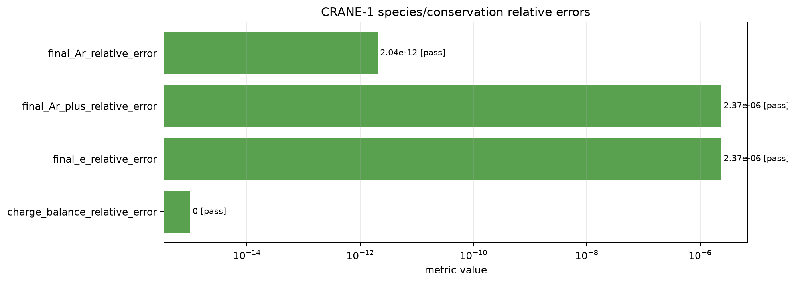

CRANE-1 の最終相対誤差は次の通りである。

| 物理量 | 本コード | CRANE参照 | 相対誤差 |
| --- | ---: | ---: | ---: |
| Ar final density [m^-3] | 2.499997826477e25 | 2.499997826472e25 | 2.04e-12 |
| Ar+ final density [m^-3] | 2.173522593682e19 | 2.173527736440e19 | 2.37e-6 |
| e final density [m^-3] | 2.173522593682e19 | 2.173527736440e19 | 2.37e-6 |
| charge balance relative error | 0 | - | 0 |

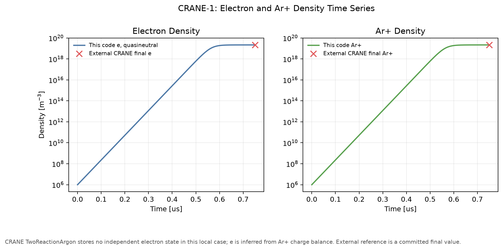

この時系列図では、青/緑の線が本コードの時間発展、赤いマーカーがCRANE保存出力の最終値を示す。CRANEケースでは電子密度を独立変数として保存していないため、電荷中性から `n_e = n_Ar+` として描いている。

考察:

- Ar+と電子密度は初期値 `1e6 m^-3` から約 `2.17e19 m^-3` まで増加し、最終値でCRANEと一致している。
- Ar中性密度は `2.5e25 m^-3` と非常に大きく、相対的な減少は小さい。このような巨大な中性背景の上で微小な電離を扱うため、単位変換と数値スケーリングが重要である。
- 電荷バランス誤差が0であり、イオンと電子の生成が化学量論通りに入っている。

本コード評価:

CRANE-1 は、本コードのもっとも基礎的な信頼性、つまり「反応式を正しく読み、SI単位で正しく積分する」ことを示している。半導体プロセス向けには、反応機構を増やしたときの土台が正しく動いていることを意味する。

### 7.2 ZDPlaskin-1: Ar DC放電と回路結合

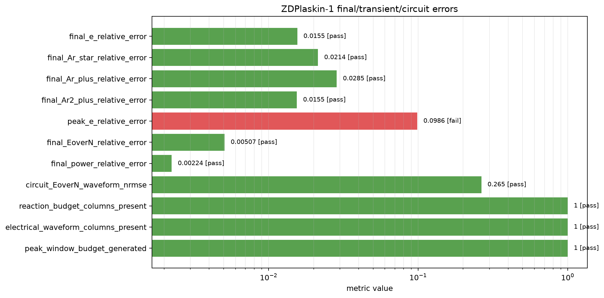

ZDPlaskin-1 の主要結果は次の通りである。

| 物理量 | 本コード | ZDPlaskin参照 | local/reference | 相対誤差 |
| --- | ---: | ---: | ---: | ---: |
| final e density [m^-3] | 3.2196355e17 | 3.170363e17 | 1.01554 | 1.55% |
| final Ar* density [m^-3] | 2.0573522e17 | 2.014270e17 | 1.02139 | 2.14% |
| final Ar+ density [m^-3] | 2.1386653e15 | 2.079332e15 | 1.02853 | 2.85% |
| final Ar2+ density [m^-3] | 3.1982488e17 | 3.149570e17 | 1.01546 | 1.55% |
| peak e density [m^-3] | 3.2196355e17 | 3.571898e17 | 0.90138 | 9.86% |
| final E/N [Td] | 2.574326 | 2.561342 | 1.00507 | 0.507% |
| final absorbed power [W] | 0.320467 | 0.321188 | 0.99776 | 0.224% |

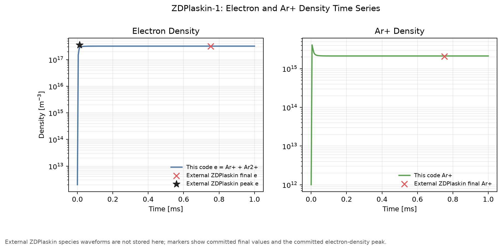

この図は、本コードの電子密度とAr+密度の時系列に、ZDPlaskin保存出力の最終値と電子密度ピークを重ねたものである。ZDPlaskin側の完全な種密度時系列は保存していないため、外部値はマーカー表示である。

考察:

- 最終電子密度は 1.55% 差で合格している。半導体装置のレシピ探索では、密度が数%以内で揃うことはかなり実用的である。
- Ar+は 2.85% 差で、正イオンの小さい成分としては妥当な一致である。
- E/Nと吸収電力は 1%未満で一致しており、外部DC回路と換算電場の扱いは良好である。
- 早期ピーク電子密度は 9.86% 差で、5%基準を超えた。これは、rate-table relaxation、回路過渡、拡散損失の閉じ方、または保存されたZDPlaskinピーク時刻とローカル出力サンプリングの違いに敏感な量である。

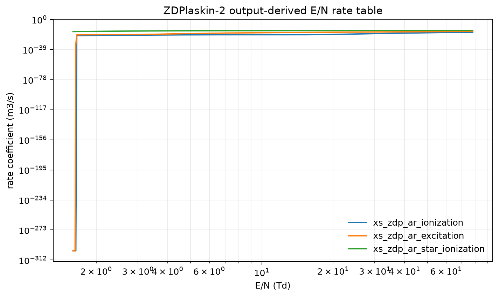

この図は、ZDPlaskin出力由来のE/N速度係数テーブルを示す。E/Nが変わると、電離、励起、Ar*電離などの速度係数が大きく変化する。プラズマ化学では、電子温度やE/Nの小さな差が反応速度に指数関数的に効くことがあるため、テーブル補間と範囲診断が重要である。

本コード評価:

ZDPlaskin-1 は、本コードが外部回路・E/N・Ar励起/分子イオン化学を含む0D問題で、最終状態を数%以内に再現できることを示す。半導体プロセスでは定常または準定常の密度・電力・E/Nが重要になることが多いため、この結果は有用性を強く支える。一方、パルス立上りや高速過渡を厳密に扱う用途では、ピーク差分の改善が次の課題である。

### 7.3 ZDPlaskin-2 / SWARM-1: rate table とスウォーム係数

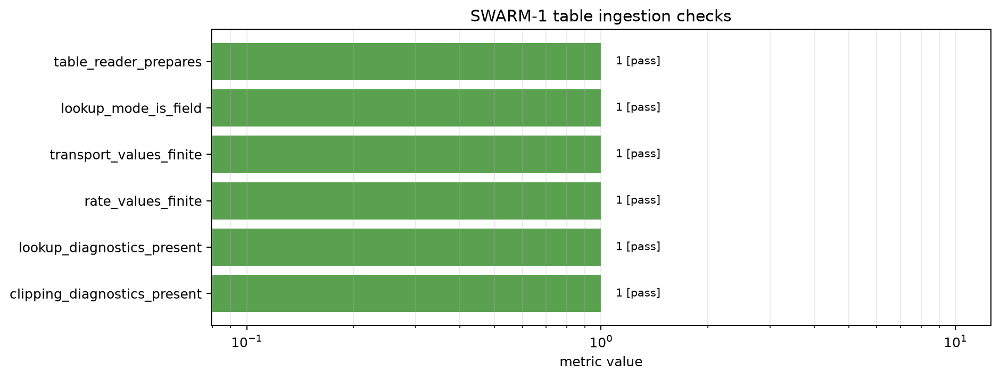

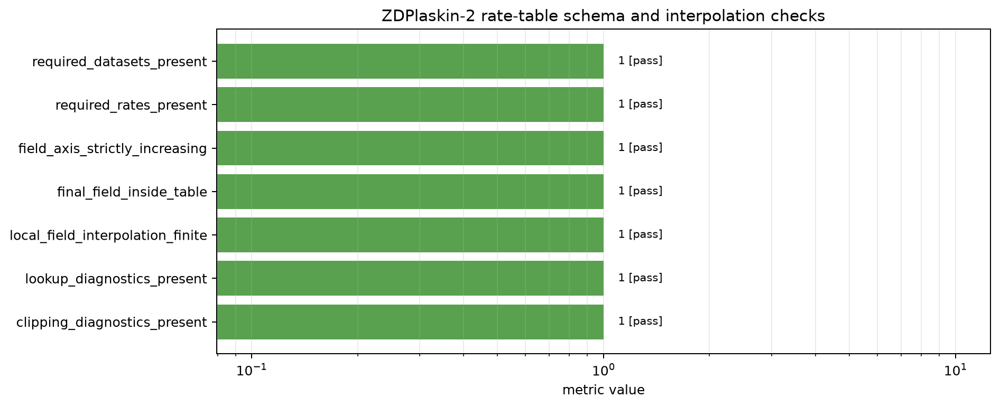

ZDPlaskin-2 と SWARM-1 は、外部Boltzmann solver由来のデータを本コードに入れる部分の検証である。全てのチェックがpassした。

| チェック | 結果 | 意味 |
| --- | --- | --- |
| required datasets present | pass | 必要なHDF5 datasetが存在 |
| required rates present | pass | 必要な反応rate IDが存在 |
| field axis strictly increasing | pass | E/N軸が単調で補間可能 |
| final field inside table | pass | 参照E/Nがテーブル範囲内 |
| local field interpolation finite | pass | 補間結果が有限 |
| lookup diagnostics present | pass | lookup値、範囲、clip有無を記録 |
| clipping diagnostics present | pass | 範囲外lookup時のclip診断が機能 |

考察:

- BOLSIG+やLoKI-Bから得た係数表をモデルに入れる場合、単位、列名、補間軸、範囲外処理のミスは非常に起きやすい。
- 本コードは、単に値を読むだけでなく、lookup値、clip有無、axis min/max を診断として残す。
- これはプロセス開発で重要である。たとえばレシピ条件を振ったときにE/Nがテーブル外へ出た場合、結果が外挿で信用できないのか、clipされているのかを後から追跡できる。

本コード評価:

外部EEDF/Boltzmann solverとの接続面は、本コードの重要な実用価値である。BOLSIG+やLoKIで作った電子衝突データを安全に使えるため、将来的にCF4/O2/Ar、Cl2/BCl3、HBr/O2などの半導体プロセスガスへ拡張しやすい。

### 7.4 PyGMol-1: productionケースのsanity比較

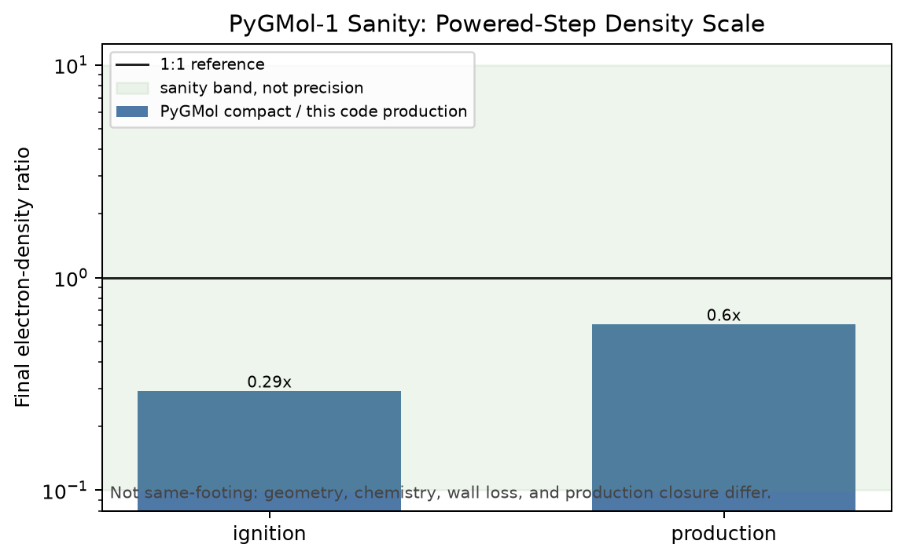

この図は、powered stepにおける最終電子密度比 `PyGMol / this code` を示す。

| step | PyGMol / this code final ne |
| --- | ---: |
| ignition | 0.292 |
| production | 0.602 |

どちらもfactor 10以内であり、sanity benchmarkとしては合格である。

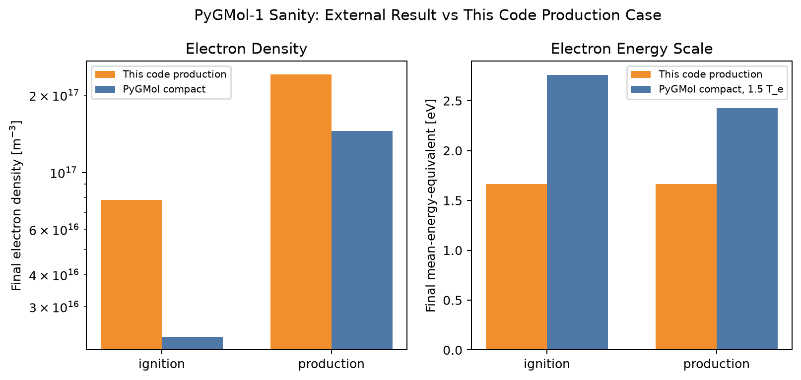

この図は、電子密度と電子エネルギー相当値の最終値を並べたものである。PyGMol compact model と本コードのproduction baselineは、厳密には同じ条件ではない。

考察:

- 電子密度はPyGMolの方が低いが、powered conditionでは同じオーダーに入っている。
- 電子エネルギー相当値はPyGMolの方が高めに出る。これは、EEDF/Te定義、電力投入、壁損失、幾何の違いが反映されたものと解釈する。
- afterglowでは密度差が大きくなるが、これは壁損失や残留電子の扱いが異なるモデルでは自然に起こる。

本コード評価:

PyGMol-1 は、「production Arケースが完全にPyGMolと一致する」ことを示す図ではない。半導体製造エンジニア向けに言えば、異なる0Dモデル間でも電子密度スケールが大きく破綻していないことを示す、健全性確認である。

### 7.5 PyGMol-Precision-1: 同一条件での高精度一致

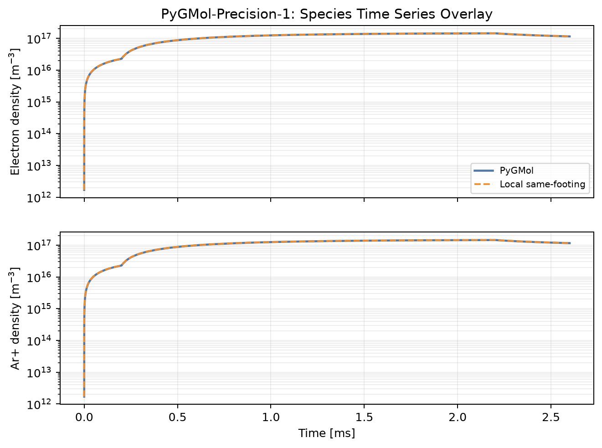

この図は、PyGMolとローカルsame-footing harnessで、電子密度とAr+密度の時間変化を重ねたものである。線がほぼ重なっており、同一方程式では高精度に一致している。

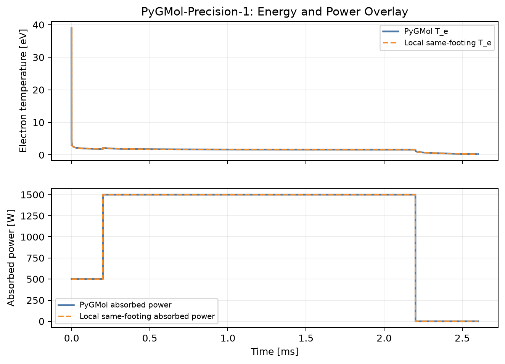

電子温度と吸収電力も同様に重なっている。電力波形やエネルギー方程式の扱いが揃っていることを確認できる。

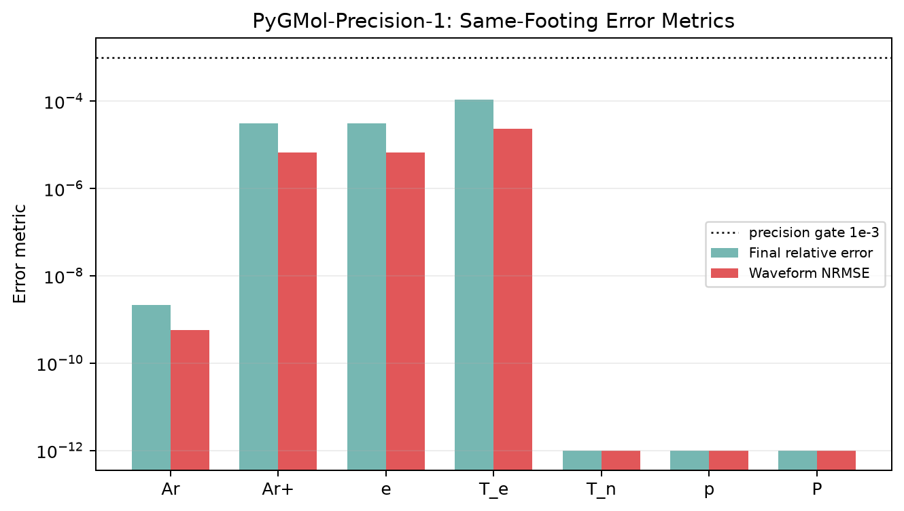

数値指標は次の通りである。

| 指標 | 値 | 閾値 |
| --- | ---: | ---: |
| max final relative error | 1.088e-4 | 1.0e-3 |
| max waveform NRMSE | 2.324e-5 | 1.0e-3 |
| electron density waveform NRMSE | 6.634e-6 | 1.0e-3 |
| final Te relative error | 1.088e-4 | 1.0e-3 |

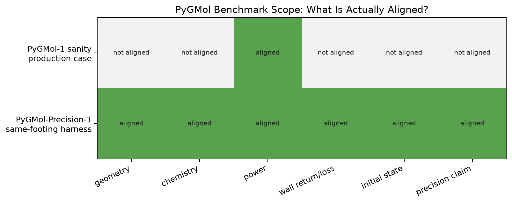

この図は、PyGMol production sanity と precision harness の違いを説明するためのものである。

| 比較 | 幾何 | 化学 | 電力 | 壁損失 | 初期値 | 精密一致主張 |
| --- | --- | --- | --- | --- | --- | --- |
| PyGMol-1 | not aligned | not aligned | partly aligned | not aligned | not aligned | no |
| PyGMol-Precision-1 | aligned | aligned | aligned | aligned | aligned | yes |

考察:

- 同じ土俵にすれば、本コードはPyGMol compact方程式を高精度に再現できる。
- productionケースで差がある場合、それは主に物理モデル・幾何・壁損失の違いであり、ODE実装の単純なバグとは区別できる。

本コード評価:

PyGMol-Precision-1 は、本コードの数値積分・物理項実装の信頼性を支える。PyGMol-1 は、本コードのproduction設定が別モデルと比べて物理スケール上大きく外れていないことを支える。両者を分けたことが重要である。

### 7.6 Runtime-1: 実行時間

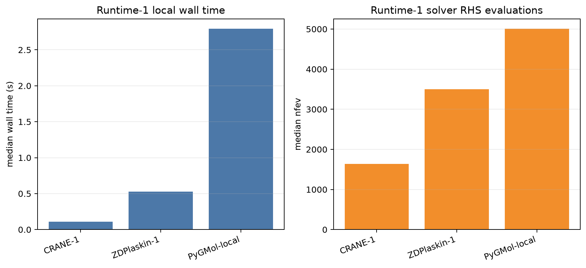

| case | median wall time | nfev median |
| --- | ---: | ---: |
| CRANE-1 | 0.108 s | 1634 |
| ZDPlaskin-1 | 0.553 s | 3497 |
| PyGMol-local | 2.865 s | 5006 |

考察:

- すべて秒オーダー以下から数秒で実行できる。
- 条件スイープ、感度解析、反応機構の候補比較に向く。
- 2D/3Dの詳細モデルに入る前のスクリーニングとして十分高速である。

## 8. 主要な考察

### 8.1 本コードが信頼できる部分

本コードは、以下の基礎機能についてベンチマーク上の信頼性を示した。

| 機能 | 根拠 |
| --- | --- |
| 反応式パースと化学量論 | CRANE-1 final species error <= 2.37e-6 |
| SI単位変換 | CRANE cm系参照値をSIに変換して一致 |
| 電荷保存 | CRANE-1 charge balance error = 0 |
| 外部回路とE/N | ZDPlaskin final E/N error = 0.507%、power error = 0.224% |
| Ar励起・イオン化化学 | ZDPlaskin final species error = 1.55-2.85% |
| E/Nテーブル読込 | ZDPlaskin-2 / SWARM-1 全項目pass |
| 0D方程式の数値実装 | PyGMol-Precision max final error = 1.09e-4 |

### 8.2 注意が必要な部分

| 注意点 | 内容 | 実務上の扱い |
| --- | --- | --- |
| ZDPlaskin早期ピーク | peak electron density error = 9.86% | パルス立上りや高速過渡評価では追加検証が必要 |
| PyGMol production比較 | same-footingではない | オーダー確認に限定し、精密一致とは呼ばない |
| SWARM-1 | ライブBOLSIG+/LoKI実行ではない | テーブル読込契約の検証であり、外部solver精度そのものではない |
| グローバルモデル一般 | 空間分布を解かない | ウェハ面内均一性、局所シース、イオンエネルギー分布は別モデルが必要 |

### 8.3 半導体プロセス開発での使いどころ

本コードは、以下の用途に特に向く。

| 用途 | 具体例 |
| --- | --- |
| レシピ探索 | 圧力、電力、ガス比を振って電子密度・イオン密度・ラジカル密度の傾向を見る |
| 反応機構評価 | どの反応がAr+、励起種、電子損失を支配するかを見る |
| 外部Boltzmann solverとの接続 | BOLSIG+/LoKI/LXCat由来の速度係数を使う |
| 詳細モデル前処理 | 2D/3D流体モデルやfeature-scaleモデルに入れる化学セットを絞る |
| 実験設計 | 実験する価値の高い条件レンジを先に絞る |

一方、次の用途では本コード単体では不足する。

| 不足する用途 | 理由 |
| --- | --- |
| ウェハ面内分布の予測 | 0Dなので空間分布を解かない |
| シース電圧波形やイオンエネルギー分布 | シース/壁近傍の詳細分布が必要 |
| マイクロローディング・形状進展 | feature-scaleモデルが必要 |
| 高速パルス過渡の厳密ピーク | 今回のZDPlaskinピーク差分が課題を示す |

## 9. まとめと本コードの評価

本ベンチマークから、本コードは低圧プラズマ・グローバルモデルとして、研究・プロセス開発の初期段階で十分に有用であると評価できる。

特に、CRANEとの強い一致は、反応ODE、単位変換、電荷保存の土台が堅いことを示している。ZDPlaskinとの比較では、外部DC回路とE/N依存rate tableを含むAr放電に対して、最終電子密度、励起種、Ar+、Ar2+、E/N、吸収電力が数%以内に入った。PyGMol同一条件ベンチでは、最大最終相対誤差 `1.09e-4`、最大波形NRMSE `2.32e-5` と高精度に一致し、0D方程式の実装品質を示した。SWARM-1では、外部Boltzmann solver由来テーブルの読込・補間・診断が通っており、将来のプロセスガス拡張に重要な基盤がある。

一方で、ZDPlaskinの早期電子密度ピークは9.86%差であり、5%基準を超えている。このため、パルスプラズマの立上りピークや高速過渡を厳密に評価する場合は、rate-table relaxation、回路応答、拡散損失、出力サンプリングの追加検証が必要である。

総合すると、本コードは以下の評価になる。

| 評価項目 | 評価 |
| --- | --- |
| 定常/準定常の0Dプロセス条件探索 | 良好 |
| 反応機構・単位・ODE実装の信頼性 | 良好 |
| E/N依存rate tableの利用基盤 | 良好 |
| 外部0Dモデルとの同一条件一致 | 良好 |
| 早期過渡ピークの厳密再現 | 改善余地あり |
| 空間分布・シース・IED評価 | 本コード単体の対象外 |

したがって、本コードは、半導体製造プロセスにおける「実験前の条件探索」「反応機構の妥当性確認」「詳細モデルへ渡す入力条件の絞り込み」に有用である。今後の改善としては、ZDPlaskin過渡ピーク差分の原因分解、ライブBOLSIG+/LoKI実行との直接比較、プロセスガス系への拡張、壁反応・表面再結合モデルの検証が優先される。

## 10. 参考文献・URL

### グローバルモデル・低温プラズマ

1. R. A. D. Hurlbatt et al., "Concepts, Capabilities, and Limitations of Global Models: A Review", Plasma Processes and Polymers, 2016. https://doi.org/10.1002/ppap.201600138
2. M. A. Lieberman and A. J. Lichtenberg, "Principles of Plasma Discharges and Materials Processing", 2nd ed., Wiley, 2005. https://books.google.com/books/about/Principles_of_Plasma_Discharges_and_Mate.html?id=m0iOga2XE5wC
3. T. Verreycken, "Zero-dimensional models for plasma chemistry", Eindhoven University of Technology, 2010. https://pure.tue.nl/ws/files/3658424/733421.pdf

### CRANE

4. CRANE GitHub repository. https://github.com/lcpp-org/crane
5. CRANE documentation. https://crane-plasma-chemistry.readthedocs.io/
6. S. Keniley and D. Curreli, "CRANE: A MOOSE-based Open Source Tool for Plasma Chemistry Applications", arXiv:1905.10004, 2019. https://arxiv.org/abs/1905.10004

### ZDPlaskin

7. ZDPlasKin official site. https://www.zdplaskin.laplace.univ-tlse.fr/
8. ZDPlaskin reference repository used for this benchmark. https://github.com/Hemadityamalla/ZDPlaskin
9. S. Pancheshnyi, B. Eismann, G. J. M. Hagelaar, L. C. Pitchford, Computer code ZDPlasKin, University of Toulouse, LAPLACE, CNRS-UPS-INP, Toulouse, France, 2008.
10. LXCat software page, ZDPlasKin description. https://nl.lxcat.net/download/

### PyGMol

11. PyGMol PyPI. https://pypi.org/project/pygmol/
12. PyGMol GitHub repository. https://github.com/hanicinecm/pygmol
13. M. Hanicinec, "Towards Automatic Generation of Chemistry Sets for Plasma Modeling Applications", PhD thesis, University College London, 2021. https://discovery.ucl.ac.uk/id/eprint/10142219/

### BOLSIG+ / LoKI / LXCat

14. BOLSIG+ official site. https://www.bolsig.laplace.univ-tlse.fr/
15. G. J. M. Hagelaar and L. C. Pitchford, "Solving the Boltzmann equation to obtain electron transport coefficients and rate coefficients for fluid models", Plasma Sources Science and Technology 14, 722-733, 2005. https://doi.org/10.1088/0963-0252/14/4/011
16. LoKI tools official page. https://nprime.tecnico.ulisboa.pt/loki/tools.html
17. LoKI-B GitHub repository. https://github.com/LoKI-Suite/LoKI-B
18. A. Tejero-del-Caz et al., "The LisbOn KInetics Boltzmann solver", Plasma Sources Science and Technology 28, 043001, 2019. https://doi.org/10.1088/1361-6595/ab0537
19. LXCat software page. https://nl.lxcat.net/download/

## 11. 付録: 生成物

| 生成物 | 内容 |
| --- | --- |
| `benchmark_metrics.csv` | 全メトリクスの数値、閾値、status |
| `benchmark_findings.md` | 閾値未達・注意項目 |
| `diagnostic_report.yaml` | 各ベンチマークの詳細YAMLレポート |
| `figures/benchmark_threshold_margin.png` | 誤差/閾値の横断図 |
| `figures/benchmark_claim_support_matrix.png` | どのベンチがどの主張を支えるか |
| `figures/benchmark_status_by_software.png` | 外部ソフト別pass/fail件数 |
| `figures/CRANE-1_density_timeseries.png` | CRANE電子密度・Ar+時系列 |
| `figures/ZDPlaskin-1_density_timeseries.png` | ZDPlaskin電子密度・Ar+時系列 |
| `figures/pygmol/*` | PyGMol sanity/precision詳細図 |
