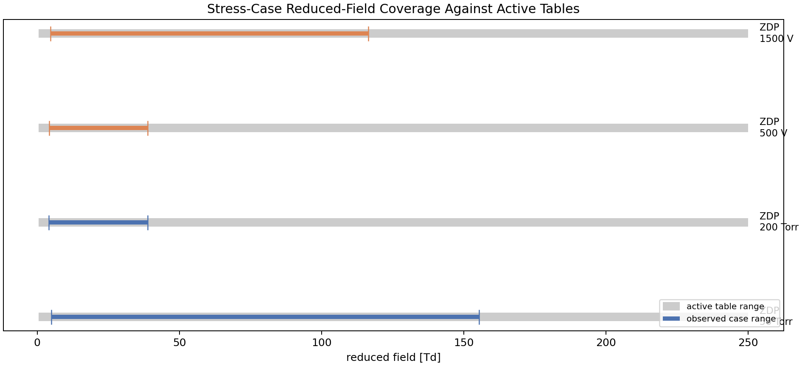

# Robustness / Applicability Benchmark Report

Generated at UTC `2026-04-25T11:24:02.002434+00:00`.

## 1. Purpose

This report extends the strict external-reference benchmark set with additional stress and applicability checks. The point is not to claim new accuracy benchmarks where no external reference exists, but to show that the code continues to run in a physically bounded way when pressure, electrical drive, and chemistry are perturbed away from the original parity cases.

## 2. What this additional benchmark content demonstrates

- strict external references retained: `2`
- additional stress / applicability cases executed: `8`
- all executed cases passed the finite-positive solver-health checks: `True`
- stress cases with explicit E/N table coverage checks that remained inside the active table: `4`

These are applicability checks, not substitutes for experimental validation or new external-reference parity cases.

## 3. Stress-case summary

| Case | Axis | Status | Final ne [m^-3] | Final mean e [eV] | Max power [W] | Max E/N [Td] | Inside table range |
| --- | --- | --- | --- | --- | --- | --- | --- |
| ZDP 50 Torr | pressure | pass | 3.364e+17 | 0.962 | 0.319 | 155 | yes |
| ZDP 200 Torr | pressure | pass | 9.523e+16 | 0.833 | 0.994 | 38.8 | yes |
| ZDP 500 V | dc_source_voltage | pass | 8.923e+16 | 0.868 | 0.264 | 38.8 | yes |
| ZDP 1500 V | dc_source_voltage | pass | 2.667e+17 | 0.919 | 0.884 | 116 | yes |
| Ar LXCat 16 Pa | pressure | pass | 4.870e+14 | 0.845 | 1.13e+03 | n/a | n/a |
| Ar LXCat baseline | electrical_backend_and_chemistry | pass | 4.180e+14 | 0.884 | 1.09e+03 | n/a | n/a |
| RF envelope | electrical_backend | pass | 2.754e+14 | 0.885 | 975 | 50 | n/a |
| CF4/O2 smoke | chemistry | pass | 3.201e+14 | 2.408 | 55.5 | n/a | n/a |

## 4. Overview figures

The first figure shows whether densities, mean energies, absorbed powers, and reduced fields remain finite and bounded across the added stress cases. The second figure focuses on the ZDPlaskin-derived pressure/voltage stress family and shows that the observed reduced-field ranges stay inside the deliberately widened diagnostic table.

## 5. Physics interpretation

The pressure and source-voltage ZDPlaskin stress family now probes a wider operating envelope without immediately leaving the active E/N table. This is important because it separates "solver survives" from "table clipping happened and made the result uninterpretable."

The pure-Ar LXCat baseline, the 16 Pa perturbation, and the RF-envelope calibration case show that the present low-pressure Ar workflow remains numerically stable across changes in pressure and electrical backend. They do not, by themselves, prove predictive accuracy, but they do support boundedness and practical usability for controlled parameter studies.

The mixed CF4/O2 smoke case is especially valuable as a chemistry-and-surface applicability check. In the current run it remains finite with final self-bias -62.7 V, final mean energy 2.41 eV. That means the code is not limited to the compact Ar validation problems and can carry a more process-like mixture with surfaces and bias-like behavior, without claiming that the predicted mixture state is externally validated.

The RF-envelope calibration case remains stable with peak electron density 2.110e+17 m^-3, max reduced field 49.98 Td. This is useful because it tests a reduced-order electrical backend that is closer to process recipes than the simplest direct-power driver.

## 6. What is still missing

- no new external-reference accuracy target was added for the stress cases
- no experimental observable comparison was added here
- surface-dominated chemistry is exercised, but not yet externally validated
- pressure/power sweeps are richer than before, but still too sparse for broad process-space claims

So the scientific message should be: the benchmark content is now broader, the code remains usable across a wider envelope, and the new cases strengthen practicality claims, but they still do not replace dedicated validation against experiment or new authoritative external references.
